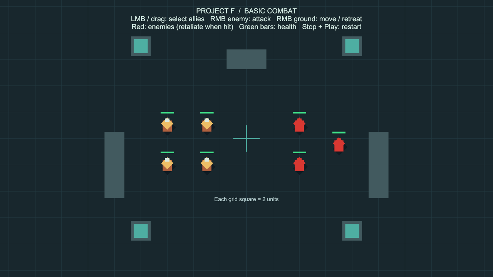
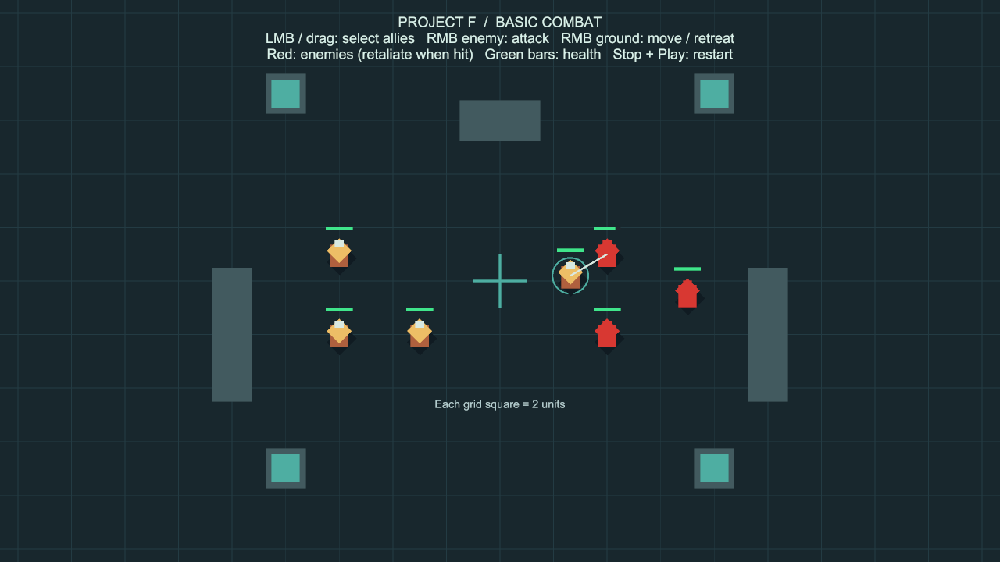

# 기본 근접 전투

상태: 2026-10-01 사용자 승인 및 main 병합 완료. 이 문서는 기본 전투 단계의 기록입니다.
후속 [적 AI](EnemyAI.md)와 [포탈 침공](PortalInvasion.md)이 같은 씬에 통합됐습니다. 현재는 시작 버튼으로 몬스터를 생성합니다. 아래 조작 설명과 검증 기록은 기본 전투 구현 당시 기준입니다.

## 실행과 조작

1. Unity 상단 **Project F → Open Basic Combat Test**를 선택하고 **Play**를 누릅니다.
2. 왼쪽의 금색 아군을 좌클릭하거나 드래그로 여러 명 선택합니다.
3. 오른쪽의 빨간 적을 우클릭하면 접근해 일정 간격으로 공격합니다. 적은 맞으면 반격합니다.
4. 머리 위 초록 막대가 체력입니다. 타격 순간 짧은 흰 선이 표시됩니다.
5. 땅을 우클릭하면 공격을 취소하고 그곳으로 이동합니다. 선택 해제는 진행 중 명령을 취소하지 않습니다.
6. 체력이 0인 유닛은 사라지고 선택·물리 충돌·길찾기 등록에서 제외됩니다.
7. Play를 종료하고 다시 시작하면 처음 배치와 체력으로 돌아갑니다.

씬: `Assets/ProjectF/Scenes/BasicCombat.unity`. 아군 4명, 적 3명입니다.
기존 이동 시험장은 **Project F → Open Mouse Command Test**로 열 수 있습니다.
빌드 씬 목록 끝에 전투 씬을 추가했습니다. 기본 시작 씬은 기존 `InputCamera`입니다.

## 조정할 수 있는 값

**Play를 종료한 상태**에서 다음 메뉴를 사용합니다.

- **Project F → Select Player Combat Settings**: 아군 설정 선택
- **Project F → Select Enemy Combat Settings**: 적 설정 선택

| Inspector 항목 | 의미 | 아군 기본값 | 적 기본값 |
| --- | --- | --- | --- |
| Max Health | 시작 최대 체력 | 100 | 75 |
| Attack Damage | 1회 피해 | 15 | 10 |
| Attack Interval | 공격 사이 시간(초) | 0.8 | 1.0 |
| Attack Reach | 두 몸통 반경 밖으로 닿는 추가 거리 | 0.85 | 0.85 |
| Pursuit Interval | 추적 목적지 갱신 검사 간격(초) | 0.3 | 0.3 |

설정 파일은 `Assets/ProjectF/Data/PlayerCombatSettings.asset`, `EnemyCombatSettings.asset`입니다.
공유 에셋을 바꾸면 이를 참조하는 모든 유닛에 적용됩니다. 체력 초기화는 새 Play에서 합니다.
병종별 설정은 **Create → Project F → Combat Settings**로 새 에셋을 만든 뒤 `Unit Combat`의 Settings에 연결하면 됩니다.
이동 속도는 기존 `LordMovementSettings`를 사용합니다.

## 규칙과 현재 범위

- 아군만 선택할 수 있고, 서로 다른 Player/Hostile 진영끼리 공격합니다. Neutral은 공격 대상에서 제외됩니다.
- 벽 등 지형 충돌체가 두 유닛 사이를 막으면 피해를 주지 않습니다.
- 반복 우클릭이나 공격 취소·재명령으로 공격 간격을 줄일 수 없습니다.
- 적의 기본 동작은 피격 반격입니다. 먼저 주변을 탐색하거나 자동으로 다음 적을 찾지는 않습니다.
- 이동 중인 적도 추적합니다. 지나갈 길이 막혔다면 기존 길찾기 규칙에 따라 기다립니다.
- 체력이 0인 오브젝트를 다시 켜서 부활시키는 API는 이번 단계에 없습니다. 재시작은 씬 재로드로 합니다.
- 원거리 공격·방어력·스킬·애니메이션·경험치·전리품·침공 AI·저장은 후속 기능입니다.
- 진영은 기본 전투 검증용 세 종류입니다. 기획서의 동맹·귀족 관계는 별도 외교 기능에서 확장할 예정입니다.

## 코드와 성능 고려

- `CombatSettings`: 공유 설정만 보관합니다. 현재 체력과 대상은 에셋에 저장하지 않습니다.
- `UnitCombat`: 유닛별 현재 체력, 공격 대상, 공격 간격, 추적과 반격 규칙을 소유합니다.
- `CombatFeedback`: 체력 변경·공격 이벤트를 받아 막대와 타격선을 갱신합니다. 게임 규칙과 표시를 분리했습니다.
- `UnitCommandController`: 우클릭한 대상에 따라 공격/이동 명령을 구분합니다.
- `CommandableUnit`: 외부 이동 명령 이벤트를 추가했습니다. 전투 추적도 기존 중앙 길찾기를 사용합니다.
- `CombatSceneSetup`: 기존 이동 씬을 복사해 최초 한 번 구성하며, 재실행 시 저장된 전투 씬을 그대로 엽니다.

매 프레임 전체 적을 찾지 않습니다. 명령 시에만 등록 유닛을 검사하고, 정지한 대상에는 경로를 계속 재발행하지 않습니다.
공격 검사 결과 배열과 재질을 재사용하며 체력 막대는 체력 변경 시에만 갱신합니다.
공격 간격 대기 중에는 벽 검사를 생략하고, 막힌 공격은 초당 최대 10회 검사합니다. 실제 피해 직전에는 벽 여부를 새로 검사합니다.
추적은 기본 0.3초 간격으로 검사하고, 대상이 0.5 이상 이동했을 때 목적지를 갱신합니다.
이는 불필요한 작업을 줄이는 설계이며, 수백~수천 명 전투 성능을 검증했다는 뜻은 아닙니다.
기존 길찾기의 대규모 성능 한계는 `GroupMovement.md`를 참고하세요.

## 사용자 확인 항목

- 아군 선택과 적 우클릭 공격이 의도대로 동작하는가?
- 공격 거리·속도·피해량이 다음 기능으로 진행할 만큼 적절한가?
- 땅 우클릭으로 이동·후퇴할 수 있는가?
- 체력 감소와 사망을 알아보기 쉬운가?

이 확인이 끝나면 승인 또는 수정 요청을 남깁니다. 승인 후 브랜치 병합과 다음 기능 하나를 진행합니다.

## 검증 기록

- 환경: 2026-09-30, Unity 6000.6.0f1, Windows, `codex/basic-combat`.
- 회귀 검사: 기존 마우스·카메라·길찾기 29개와 전투 13개, **42개 통과 / 실패 0 / 건너뜀 0**, 99.11초. `Logs/combat-tests-final.json`.
- 화면 검사에서 첫 프레임 체력 막대 초기화 문제를 발견해 수정했습니다. 이후 시작·씬 재로드 검사를 추가하여 전투 **14개 통과 / 실패 0 / 건너뜀 0**, 17.59초. `Logs/combat-tests-feedback-final.json`. 마지막 수정은 표시 컴포넌트 초기화와 해당 테스트입니다.
- 마우스 아군 선택, 우클릭 접근·공격·반격·사망, 이동 취소, 연속 명령 공격 간격, 우호·중립 대상 보호, 벽 차단·제거, 움직이는 적 추적, 대상 비활성화·파괴, 사망 이벤트·선택·충돌 해제, 다수 유닛 공격, 일시정지와 체력 표시, 전투 컴포넌트 비활성화를 검사했습니다.
- Play Mode 화면에서 시작 체력 막대, 선택 표시, 첫 타격선과 적 체력 75→60 감소를 확인했습니다. 캡처를 위한 일시정지는 저장하지 않았습니다.
- 전투 씬 유닛 7개, 누락 스크립트 0개. ProjectF 에셋의 누락 meta와 중복 GUID 0개.
- 최종 Windows x64 증분 빌드 성공: 오류 0, 기존 Pipeline 안내 경고 1, 2.54초, 132,759,246 bytes. `Logs/combat-build-final.json`. 실행 파일: `Builds/BasicCombat/ProjectF_BasicCombat.exe`. 이 별도 빌드는 전투 씬으로 시작합니다.
- 최종 실행 파일을 화면 없는 모드로 시작해 프로세스 유지와 Input System·엔진 초기화를 확인했고 로그에 예외가 없었습니다. `Logs/BasicCombat-player-final.log`. 실행 파일의 실제 마우스·렌더링 검사는 하지 않았으며 해당 상호작용은 에디터에서 검증했습니다.
- 첫 빌드는 성공했지만 동기 제어 요청이 5초 제한을 넘어 도구 오류 1건이 빌드 보고서에 섞였습니다. 비동기 빌드로 재검증해 최종 오류 0건을 확인했습니다. 첫 빌드의 기존 AI inference 셰이더 경고 500건과 Pipeline 안내는 `Logs/combat-build-report.json`에 보존했습니다.
- Unity에는 저장된 전투 씬을 열어 두고 Play와 일시정지를 종료했습니다. 검사용 실행 파일도 종료했습니다.
- 원래 이동 씬·패키지·이동 설정은 수정하지 않았습니다. 프로젝트 설정 변경은 빌드 씬 목록에 `BasicCombat`을 추가한 것뿐입니다.
- 수백~수천 명 교전, 장시간 전투, 출시용 밸런스·아트는 아직 검증 범위가 아닙니다.
