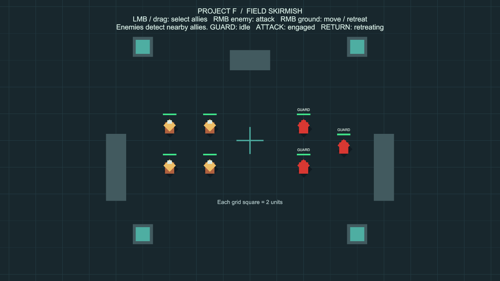
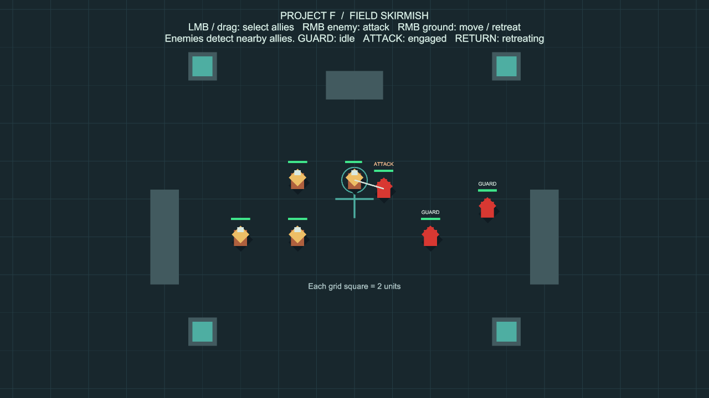
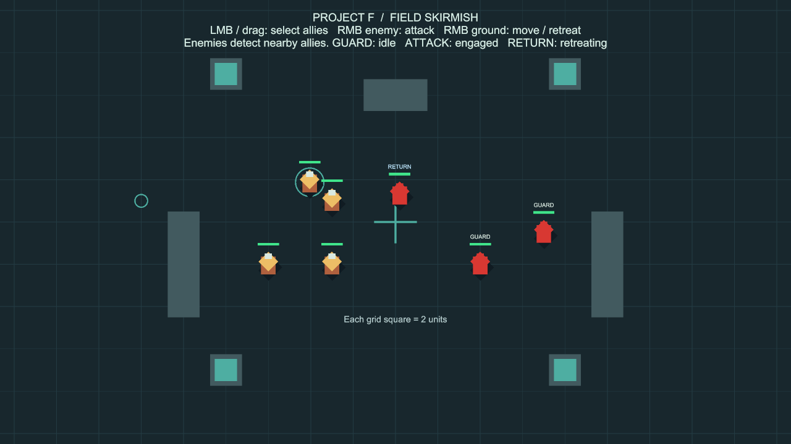

# 적 자동 탐지·교전·복귀

상태: 사용자 승인 완료, `main` 병합 완료 (`3901f98`).

아래는 경계형 적 AI 구현 당시의 사용법과 검증 기록입니다. 현재 플레이 씬은 [포탈 침공](PortalInvasion.md)으로 이어졌으며, 몬스터가 포탈에서 생성되어 진격합니다. 경계형 AI 규칙은 목적지 도착 이후와 기존 회귀 검사에서 계속 사용합니다.

## 현재 게임에서 실행

Unity 상단 **Project F → Open Gameplay → Play**.
기존 `BasicCombat` 씬의 적 3명에 통합했습니다. 별도 전투·이동 시스템이나 새 시험 씬을 만들지 않습니다.
이 씬을 빌드 씬 목록의 첫 번째로 지정하여 일반 **Build And Run**도 현재 플레이 버전으로 시작합니다.
아군의 선택·우클릭 공격·이동은 이전과 같습니다.

1. 왼쪽 금색 아군 한 명을 선택합니다.
2. 오른쪽 적과 약 5단위 이내가 되도록 땅을 우클릭해 접근합니다. 바닥 큰 격자 한 칸은 2단위입니다.
3. 적이 먼저 아군을 발견하고 접근·공격하는지 확인합니다. 아군은 직접 공격 명령을 내립니다.
4. 아군에게 왼쪽 먼 곳으로 이동 명령을 내려 도망갑니다. 적의 시작 위치에서 8단위를 넘으면 적은 추적을 중단하고 복귀합니다.
5. 복귀가 끝난 뒤 다시 접근하면 적이 재탐지합니다. 체력은 복귀해도 회복되지 않습니다.

| 표시 | 의미 |
| --- | --- |
| GUARD | 시작 지점을 지키며 탐지 중 |
| ATTACK | 발견한 한 대상을 추적·공격 중 |
| RETURN | 대상을 포기하고 시작 지점으로 복귀 중 |

## 세부 규칙

- 탐지 반경 안에서 가장 가까운 **보이는 적대 유닛**을 고릅니다. 벽 뒤의 유닛과 중립·동일 진영·사망 유닛은 제외합니다.
- 한 번 고른 대상은 유효한 동안 유지합니다. 더 가까운 유닛이 지나간다고 즉시 목표를 바꾸지 않습니다.
- 대상 또는 자신의 위치가 시작 지점 기준 추적 한계를 넘으면 복귀합니다.
- 시야를 잠깐 잃으면 추적을 유지하고, 기본 2초 동안 계속 보이지 않으면 포기합니다.
- 이동도 공격도 진행되지 않는 상태가 기본 4초 지속되면 추적을 포기합니다.
- 대상이 죽거나 비활성화되면 복귀합니다. 복귀 후 재정비 시간을 거쳐 새 대상을 탐지합니다.
- 복귀 중에는 탐지와 자동 반격을 중단합니다. 피해와 사망은 정상 적용되며 무적·자동 회복은 없습니다.
- 복귀 지점이 막히면 갈 수 있는 곳에서 기다립니다. 지형이 열리면 기존 길찾기로 다시 접근합니다. 순간이동하지 않습니다.
- 일시정지(`Time.timeScale = 0`) 중에는 탐지·추적 판단 시간도 멈춥니다.
- 살아 있는 AI 컴포넌트를 껐다 켜면 새 활성화 위치를 경계 지점으로 삼습니다. 사망 유닛의 부활은 별도 기능입니다.
- 아군 자동 공격 정책은 추가하지 않았습니다. 적 AI만 자동으로 명령을 내립니다.

## 설정

Play를 종료한 뒤 **Project F → Select Enemy AI Settings**에서 변경합니다.

| 항목 | 기본값 | 의미 |
| --- | --- | --- |
| Detection Radius | 5 | 새 대상을 찾는 반경, 유닛 중심 기준 |
| Leash Radius | 8 | 시작 지점에서 허용하는 추적 한계. 탐지 반경 이상으로 보정 |
| Think Interval | 0.25초 | 탐지·시야·정체 판단 주기 |
| Lost Sight Delay | 2초 | 지속적인 시야 상실 허용 시간 |
| Stalled Pursuit Timeout | 4초 | 이동·공격 진전 없이 허용하는 추적 시간 |
| Return Tolerance | 0.6 | 시작 위치에 복귀했다고 판단하는 거리 |
| Return Retry Interval | 1초 | 대체 목적지에 도착했으나 복귀 지점에 못 닿았을 때 재요청 간격 |
| Recovery Delay | 1초 | 복귀 후 재탐지까지의 재정비 시간 |

에셋: `Assets/ProjectF/Data/EnemyAISettings.asset`.
다른 병종에는 **Create → Project F → Enemy AI Settings**로 별도 에셋을 만들어 연결할 수 있습니다.
체력·공격력·공격 속도는 기존 `EnemyCombatSettings`, 이동 속도는 `LordMovementSettings`에서 설정합니다.
씬에서 적을 선택하면 Scene 뷰의 Gizmos로 탐지 반경(청록)과 추적 한계(주황)를 볼 수 있습니다.

## 유지보수 구조

- `EnemyCombatAI`: 대상 선정과 Guarding/Engaging/Returning 전환. 활성화된 동안 적의 자율 명령을 소유합니다.
- `EnemyAISettings`: 공유하는 설정값. 대상·현재 상태·경계 위치는 유닛별 런타임 값입니다.
- `EnemyAIStatusView`: 상태 변경 이벤트를 받아 글자만 갱신합니다.
- `UnitCombat`: 기존 피해·공격 간격·사망 처리 유지. 활성 AI가 있을 때 기존 피격 반격을 억제해 복귀 명령과 충돌하지 않도록 했습니다. 시야 검사는 전투와 AI가 같은 함수를 사용합니다.
- `CommandableUnit` / `NavigationWorld2D`: 기존 이동·장애물 우회·예약 경로를 그대로 사용합니다.
- `EnemyAISetup`: 저장된 전투 씬에 컴포넌트를 추가하는 에디터 도구. 기존 유닛을 다시 생성하지 않고, 이미 존재하는 AI 설정 참조를 보존합니다.

## 성능 고려와 범위

- 매 프레임 씬 전체를 검색하지 않습니다. Unity 2D 물리의 영역 조회로 주변 후보만 가져옵니다.
- 조회 목록은 재사용하며, 후보가 많을 때 필요한 만큼 늘어납니다. 고정 길이 배열 초과로 적을 누락하지 않습니다.
- 유닛마다 첫 탐지 시점을 분산하고, 이후 기본 초당 약 4회 판단합니다. 시간 지연이 생겨도 밀린 판단을 한 프레임에 반복하지 않습니다.
- 교전 중에는 새 후보를 검색하지 않고 현재 대상만 검사합니다. 복귀 중에는 대상 검색을 하지 않습니다.
- 생존·추적 한계는 물리 프레임마다 가벼운 거리 검사로 확인해 이미 무효인 대상에 추가 공격하지 않도록 합니다.
- 프로파일러에 `ProjectF.EnemyAI.Detect` 구간을 표시합니다. 이는 탐지 비용이며 기존 길찾기 비용과는 별도입니다.
- 32명 대기 검사와 현재 전투 씬 검증은 수백~수천 명 실전 교전 성능 보장이 아닙니다. 밀집 교전에서는 기존 중앙 길찾기 비용도 함께 측정해야 합니다.

이번 범위는 경계병 AI입니다. 몬스터 생성·웨이브·포탈·부대 단위 전술·시야 안개·외교·세이브는 별도 단계입니다.

## 검증 기록

- Unity 6000.6.0f1 / Windows / `codex/enemy-ai`.
- 새 AI 검사 13개 통과, 실패 0, 건너뜀 0, 22.48초. `Logs/enemy-ai-tests-first.json`.
- 전체 PlayMode 검사 **56개 통과, 실패 0, 건너뜀 0**, 124.95초. 기존 이동·카메라 29개, 기본 전투 14개, 적 AI 13개. `Logs/enemy-ai-tests-final.json`.
- 범위 밖 대기, 자동 접근·공격, 가장 가까운 가시 대상 선정과 유지, 벽 시야 차단, 추적 한계 복귀, 복귀 중 피해·무반격·무회복, 시야 상실, 이동 정체, 대상 사망 후 재탐지, 막힌 복귀 경로 복구, AI 비활성화·재활성화, 일시정지, 32명 탐지 주기를 검사했습니다.
- 32명 대기 검사에서 게임 시간 1.00초 동안 탐지 123회를 기록했습니다. 설정은 0.25초이며, 이 값은 탐지 주기 검증입니다. FPS나 전체 전투 CPU 성능 수치가 아닙니다.
- ProfilerRecorder 자동 시간 측정에서 비정상적인 값이 반환되어 해당 측정 코드를 제거했습니다. 그 수치는 보고에 사용하지 않았으며, 런타임의 프로파일러 구간 표시는 유지했습니다.
- 측정 코드 정리 후 같은 32명 주기 검사를 재실행해 통과했습니다(1개, 1.26초). `Logs/enemy-ai-cadence-final.json`. 런타임 코드는 전체 56개 검사 이후 변경하지 않았습니다.
- Play Mode에서 아군에게 접근 이동 명령만 내린 후 적이 자동 공격하여 체력이 100→90으로 감소하는 것을 확인했습니다. 이후 후퇴 명령으로 아군이 적의 시작 위치에서 8단위 이상 떨어졌을 때 `RETURN` 전환을 확인했습니다. 캡처용 일시정지·콜백은 저장하지 않았습니다.
- 씬의 전투 유닛 7개, 적 AI 3개, 누락 스크립트 0개. 새 에셋의 meta 파일과 ProjectF GUID 중복 검사를 통과했습니다.
- Windows x64 빌드 성공: 오류 0, 기존 패키지 경고 501건(AI inference 셰이더 500건, Pipeline 안내 1건), 13.696초, 132,768,286 bytes. `Logs/enemy-ai-build-final.json`.
- 실행 파일: `Builds/EnemyAI/ProjectF_EnemyAI.exe`. 일반 빌드 설정을 사용해 현재 플레이 씬이 시작되도록 구성했습니다.
- 실행 파일을 화면 없는 모드로 시작해 프로세스 유지, 엔진·Input System 초기화 및 시작 로그에 예외가 없음을 확인했습니다. `Logs/EnemyAI-player.log`. 별도 실행 파일의 마우스·화면 검사는 수행하지 않았고, 실제 교전 화면과 상호작용은 에디터에서 검증했습니다.
- 검사용 실행 파일과 Play·일시정지는 종료했습니다. Unity에는 저장된 `BasicCombat` 플레이 씬을 열어 두었습니다.
- 기존 씬 유닛은 재생성하지 않았고, AI·상태 표시 컴포넌트 및 안내문만 추가했습니다. 빌드 시작 씬을 `BasicCombat`으로 변경했습니다. 패키지와 물리·그래픽 설정은 변경하지 않았습니다.
