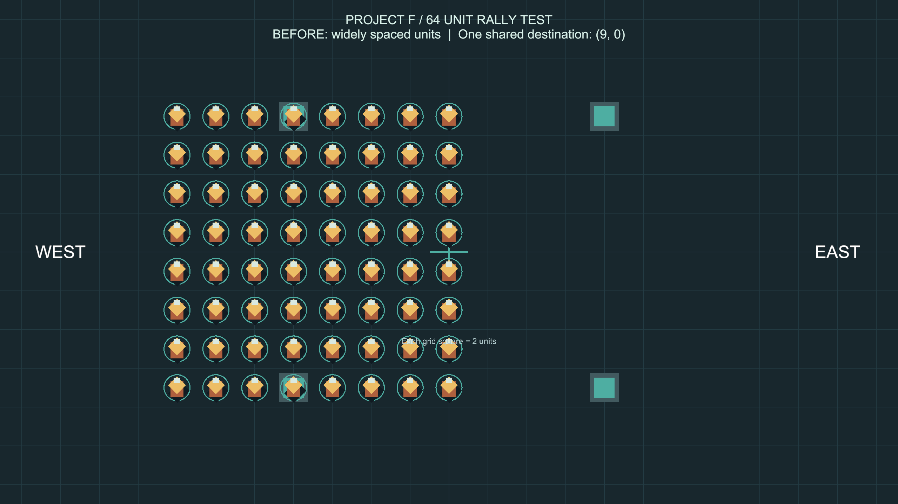
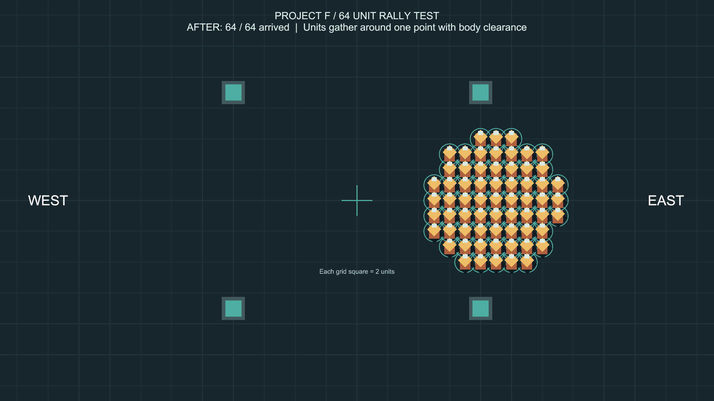

# 집결 이동과 병력 규모 대응

여러 유닛을 선택한 뒤 한 지점을 우클릭하면 그 지점 주변으로 모입니다. 시작할 때 A와 B가 멀리 떨어져 있더라도 그 거리를 도착 위치에 그대로 복사하지 않습니다. 유닛 몸통이 겹칠 수는 없으므로 인원이 많을수록 집결 범위가 넓어집니다.

## 이번에 바꾼 처리

- 모든 선택 유닛이 같은 클릭 위치를 요청합니다. 클릭 위치에 가까운 유닛부터 안쪽 도착 공간을 배정받고, 나머지는 바깥 빈 공간을 찾습니다.
- 도착 공간을 찾던 기존 반경 4 제한을 없앴습니다. 많은 인원이 선택되어도 이 제한 때문에 일부 명령이 취소되지 않습니다. 지도 안에서 가까운 빈 공간부터 찾습니다.
- 같은 집결점 주변의 도착 후보 목록을 재사용합니다. 정지 유닛과 먼저 배정된 목적지, 벽을 고려하고 서로 겹치는 위치를 배정하지 않습니다.
- 실행 중 생성된 유닛도 길찾기에 등록되면 클릭·드래그 선택 대상에 포함됩니다.
- 몸통 크기별로 지형 정보를 나눠 재사용합니다. 큰 기병이 있어도 작은 보병의 통로가 함께 막히지 않습니다.
- 유닛별 속도와 반경으로 통과 시간·간격을 계산합니다. 빠른 유닛도 다른 유닛을 통과하거나 겹치지 않고 추월·우회합니다.
- 경로 예약을 시간과 공간별로 나눠, 같은 시간에 근처를 지나는 유닛만 정확한 충돌 검사를 합니다.
- 집단 규모가 커지면 유닛당 탐색량을 나눕니다. 제한 안에서 목적지까지 찾지 못하면 안전한 중간 경로를 사용하고 다음 갱신에서 이어 찾습니다.
- 예외적인 충돌 위험이 생겼을 때 관련 유닛부터 정지시키고, 그 정지에 영향받는 유닛을 추가로 검사합니다. 떨어진 곳의 유닛까지 일괄 정지시키지 않습니다.

## 기병과 보병에 대한 기준

현재는 '몸통이 크고 속도가 빠른 유닛'을 기병 역할로 만들어 검사합니다. 병과 데이터나 전투 돌격 피해를 구현한 것은 아닙니다. 일반 이동에서 보병 사이에 몸통이 통과할 공간이 있으면 지나가고, 공간이 부족하면 돌아가거나 기다립니다.

나중에 기병 돌격을 전투로 만들 때는 일반 이동과 별도로 적·아군 구분, 돌격 속도, 충격, 밀려남, 피해, 대형 붕괴 규칙을 정해야 합니다. 일반 이동의 충돌 회피만으로 보병 진형을 강제로 관통시키면 아군 통행과 적군 전투가 섞이므로, 이번 이동 규칙은 유지한 채 전투 규칙을 별도로 연결하는 구조가 적합합니다.

유닛 크기는 현재 CircleCollider2D와 Transform 크기, 속도는 각 유닛이 참조하는 LordMovementSettings 데이터로 정합니다. 병과가 늘면 병과별 이동 설정 데이터를 연결하면 됩니다.

## 직접 확인하기

1. **Project F → Open Mouse Command Test → Play**를 누릅니다.
2. 유닛 두 개를 서로 멀리 떨어뜨립니다.
3. 두 유닛을 드래그로 함께 선택하고 빈 땅 한 지점을 우클릭합니다.
4. 두 유닛이 이전 간격을 유지하지 않고 클릭 지점 근처로 모이는지 확인합니다.
5. 네 유닛 전체를 선택해 회색 장애물 근처로 보내고, 도착 위치가 겹치거나 벽 안에 잡히지 않는지 확인합니다.

선택·카메라 조작은 이전과 같습니다. 단체 이동이 집결 방식으로 바뀌었으며, 별도의 대형 유지 명령은 아직 없습니다.

## 규모를 더 늘릴 때

한 번에 경로를 찾는 양에 상한을 두었지만, 모든 병력 규모에서 일정한 프레임 시간을 보장하는 것은 아닙니다. 현재 시험장은 작은 지도이며 이후 수백·수천 유닛을 목표로 한다면 그 수치와 목표 PC를 정해서 검증해야 합니다.

다음 확장 순서는 공통 목적지의 큰 길을 공유하기, 충돌 가능성이 있는 지역별로 병력을 나눠 처리하기, 경로 탐색을 여러 프레임이나 작업 스레드에 분산하기입니다. 현재의 개별 목적지·몸통 크기·이동 우선권 규칙은 이때도 유지할 수 있습니다. 적군의 통로 봉쇄와 아군 양보는 전투 단계에서 구분해야 합니다.

## 검증 기록

Unity 6000.6.0f1 / Windows / Input_Camera 브랜치에서 2026-09-21 검증했습니다.

- PlayMode 자동 검사 **29개 통과, 실패 0, 건너뜀 0**. 실행 시간 83.88초.
- 기존 선택·마우스 조작·카메라·장애물 회피·맞교차·막힌 통로 복구 검사를 포함합니다.
- 추가 검사: 같은 클릭 위치로 집결, 실행 중 추가된 유닛 드래그 선택, 64명 집결, 크기가 다른 12명 집결, 크기·속도가 다른 32명의 사방 교차, 큰 고속 유닛의 보병 추월, 큰 유닛이 있어도 보병의 좁은 통로 유지.
- 집단 이동 검사는 이동 중 매 물리 갱신마다 몸통이 겹치지 않는지도 검사합니다. 64명 집결과 32명 교차의 예외 안전 정지 횟수는 모두 0회였습니다.

| 상황 | 경로 재계산 1회 평균 | 최대 | 결과 |
|---|---:|---:|---|
| 16명 맞교차 | 1.71ms | 3.95ms | 전원 도착 |
| 64명 한 점 집결 | 28.26ms | 77.48ms | 전원 도착, 집결 반경 약 4.47 |
| 32명 혼합 병력 사방 교차 | 34.12ms | 89.93ms | 전원 도착 |

위 수치는 에디터에서 경로 재계산 부분을 측정한 값이며 전체 프레임 시간이나 FPS가 아닙니다. 재계산은 기본 0.5초 간격이고 명령 변경·경로 이탈 등에도 실행됩니다. 혼잡한 순간에는 눈에 띄는 끊김이 생길 수 있습니다. 이번 작업은 집결 동작과 충돌 회피를 검증한 단계이며 대규모 전투의 성능 완료 판정은 아닙니다. 최초 64명 집결 구현의 최대 약 960ms에서 공간별 예약 검사와 탐색량 배분을 적용해 약 77ms로 줄였지만, 여러 프레임에 분산하는 후속 최적화가 필요합니다.

검사 원본은 `Logs/gather-tests-final.json`에 있습니다. Logs는 Git 제외 대상입니다.

- Windows x64 빌드 성공, 오류 0, 14.02초, 약 132.67MB. `Builds/InputCamera/ProjectF_InputCamera.exe`를 다시 만들었습니다.
- 기존 AI inference 셰이더 경고 500건과 Pipeline이 Player에서 비활성화된다는 경고 1건이 남아 있습니다.
- 실행 파일의 실행·응답과 그래픽·입력·물리 초기화를 확인했습니다. 시작 로그에 게임 코드 예외는 없었습니다. 실행 파일에서 마우스 조작을 자동 검사한 것은 아니며, 조작 검사는 에디터 PlayMode에서 수행했습니다.
- 빌드 보고서 `Logs/gather-build-report.json`, 시작 로그 `Logs/Gather-player.log`.
- 최종 씬은 기본 유닛 4명, 장애물 3개, 누락 스크립트 0개, 저장 완료 및 Play 종료 상태입니다. 진단용 64명은 씬에 저장하지 않았습니다.
- 작업은 `Input_Camera` 브랜치에 있으며 커밋·푸시·main 병합은 하지 않았습니다.

## 실제 실행 화면

기본 시험 씬의 4명을 일시적으로 64명으로 늘려 같은 이동 명령을 실행한 캡처입니다. 이 진단에서는 장애물을 끄고 빈 공간 집결을 확인했으며, 기본 씬에는 4명과 기존 장애물을 유지했습니다. 아래 청록색 원은 선택 표시이고 실제 충돌 몸통보다 큽니다.

이동 전 — 유닛들이 넓게 떨어져 있습니다.

이동 후 — 기존 간격을 유지하지 않고 한 지점 주변으로 모였습니다. 실제 실행에서도 64명 전원이 도착했습니다.

