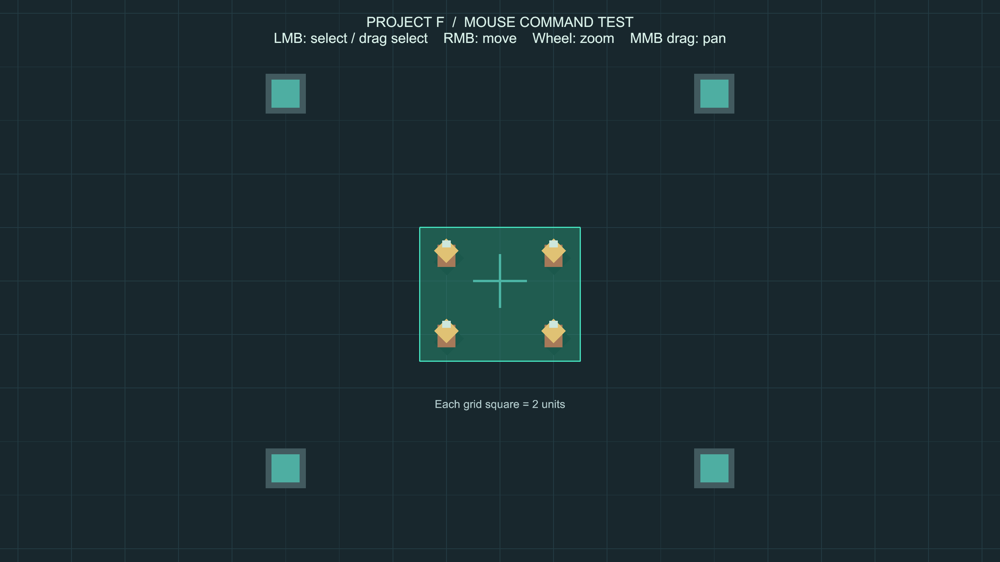
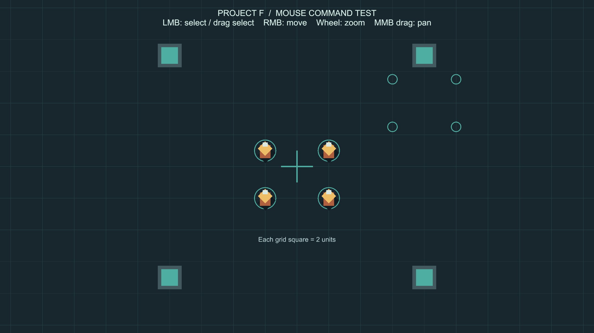

# 마우스 유닛 지휘와 전략 카메라

`Input_Camera` 브랜치의 첫 기능입니다. 림월드·스타크래프트처럼 멀리서 유닛을 선택하고 이동 명령을 내리는 방식입니다. 기존 키보드 직접 이동과 캐릭터 추적 카메라는 교체했습니다.

## 실행 순서

1. Unity에서 `C:/Unity/Proejct_F`를 엽니다.
2. **Project F → Open Mouse Command Test**를 누릅니다.
3. **▶ Play**를 누르고 **Game** 탭을 선택합니다.
4. 금색 임시 유닛을 좌클릭한 다음 빈 땅을 우클릭합니다.
5. 여러 유닛을 포함하도록 좌클릭을 누른 채 사각형을 그린 뒤 손을 떼고, 빈 땅을 우클릭합니다.
6. 마우스 휠과 가운데 버튼 드래그로 카메라를 시험합니다.
7. 검사가 끝나면 **■ Stop**을 누릅니다.

씬을 직접 열려면 `Assets/ProjectF/Scenes/InputCamera.unity`를 더블클릭합니다. 메뉴는 이미 존재하는 씬을 열기만 하며 편집 내용을 다시 생성하지 않습니다.

## 조작과 기대 동작

| 조작 | 결과 |
|---|---|
| 유닛 좌클릭 | 해당 유닛 하나만 선택. 청록색 원이 표시됩니다. |
| 좌클릭 드래그 후 놓기 | 사각형에 중심이 들어온 유닛들을 선택합니다. 어느 방향으로 그려도 됩니다. |
| 빈 땅 좌클릭 | 선택을 해제합니다. 이미 받은 이동 명령은 계속 수행합니다. |
| 선택 후 우클릭 | 선택된 유닛들에 목적지를 지정합니다. 도착하면 멈춥니다. |
| 이동 중 다시 우클릭 | 새 목적지로 변경합니다. 명령을 줄 세워 예약하지 않습니다. |
| 여러 유닛 선택 후 우클릭 | 클릭 지점 주변의 빈 공간에 모입니다. 인원이 많을수록 집결 범위가 넓어집니다. |
| 선택 없이 우클릭 | 아무 유닛도 움직이지 않습니다. |
| 휠 위 / 아래 | 커서 주변을 기준으로 확대 / 축소합니다. 지도 경계에서는 화면 위치가 제한됩니다. |
| 가운데 버튼을 누른 채 드래그 | 화면을 잡아 끌듯 카메라를 이동합니다. |
| WASD / 방향키 | 유닛이나 카메라를 이동시키지 않습니다. |

드래그 사각형은 **선택** 기능입니다. 선택한 뒤 **우클릭**으로 이동합니다. 유닛을 잡아서 목적지까지 끌어놓는 방식은 아닙니다.

카메라는 유닛을 따라가지 않습니다. 유닛은 화면 밖으로도 이동할 수 있으며 가운데 버튼 드래그로 따라가서 볼 수 있습니다. 기본 카메라 크기는 10.5, 확대 한계는 5, 축소 한계는 14입니다. 숫자가 작을수록 크게 보입니다. 화면 비율에 따라 가로 시야와 카메라 이동 가능 범위가 달라집니다.

## 화면의 의미

- 금색 도형 4개: 단일·단체 선택 검사용 임시 유닛입니다. 아직 영웅·병과 규칙은 없습니다.
- 유닛 아래 큰 청록색 원: 현재 선택된 유닛입니다.
- 땅 위 작은 청록색 원: 각 유닛의 목적지입니다. 도착하면 사라집니다.
- 반투명 사각형: 현재 드래그 중인 선택 범위입니다.
- 격자 한 칸: 월드 2단위입니다.
- 바깥 벽: 시험장 경계입니다. 이동 목적지는 벽 안쪽으로 제한됩니다.
- 상단 조작 안내: 카메라가 움직여도 화면에 고정됩니다. 최종 게임 UI는 아닙니다.

### 드래그 선택

### 이동 명령

위 이미지는 실제 Unity Play Mode 화면입니다. 첫 화면은 가상 마우스로 드래그한 상태입니다. 두 번째는 표시를 자세히 볼 수 있도록 검증용으로 각 유닛에 선택 상태와 이동 목적지를 지정하고, 이동 시간을 잠시 멈춘 상태입니다. 클릭부터 목적지 도착까지의 전체 입력 흐름은 별도의 자동 테스트에서 확인했습니다.

## 속도와 카메라 설정 바꾸기

**이동 속도:** Play를 종료하고 **Project F → Select Movement Settings**를 누른 뒤 Inspector의 **Move Speed**를 변경합니다. 기본값은 5, 초당 월드 5단위입니다. 0이면 이동하지 않습니다. 설정 파일 `Assets/ProjectF/Data/LordMovementSettings.asset`을 네 유닛이 공유합니다. 파일 이름의 Lord는 이전 작업에서 이어진 이름이며 현재는 네 유닛에 공통으로 적용됩니다. 데이터 에셋은 실행 중 변경해도 값이 남을 수 있으므로 실행을 종료한 뒤 수정하세요.

**카메라:** Hierarchy에서 **Main Camera**를 선택합니다. **Camera → Size**는 시작 시야, **Strategy Camera 2D → Minimum Size / Maximum Size**는 줌 범위, **Map Bounds**는 지도 범위입니다. 기본값으로 검사를 마친 뒤 조정하세요.

## 구현 파일과 역할

아래 경로는 `Assets/ProjectF/` 기준입니다.

| 파일 | 역할 |
|---|---|
| `Runtime/Input/CommandInput.cs` | Unity Input System으로 마우스 위치·좌우·가운데 버튼·휠 입력을 읽습니다. 자신이 만든 입력 액션만 활성화·해제합니다. 키보드 이동 바인딩이 없습니다. |
| `Runtime/Input/UnitCommandController.cs` | 클릭·사각형 선택, 선택 표시 전환, 선택한 유닛들의 목적지 배정, 지도 경계 제한을 처리합니다. |
| `Runtime/Player/CommandableUnit.cs` | 목적지를 받아 Rigidbody2D로 이동하고 도착 시 멈춥니다. 선택 원과 목적지 표시도 관리합니다. |
| `Runtime/Player/LordMovementSettings.cs` | 이동 속도 데이터 형식을 정의합니다. |
| `Runtime/Camera/StrategyCamera2D.cs` | 유닛과 독립적으로 휠 줌, 가운데 드래그, 지도 경계 제한을 처리합니다. |
| `Data/LordMovementSettings.asset` | 실제 이동 속도 값을 저장합니다. |
| `Scenes/InputCamera.unity` | 유닛 4개, 카메라, 지휘 입력, 선택 UI, 바닥·벽과 참조 연결을 저장합니다. |
| `Development/TestGeometry.asset` | 시험장·유닛용 임시 메시와 재질입니다. |
| `Editor/InputCameraSceneSetup.cs` | 시험 씬 열기와 속도 설정 선택 메뉴를 제공합니다. 게임 빌드에는 포함되지 않습니다. |
| `Tests/PlayMode/MouseCommandTests.cs` | 실제 씬과 가상 마우스·키보드를 사용하는 자동 검사입니다. |

처리 흐름은 **마우스 → 선택/명령 처리 → 각 유닛의 목적지 → 물리 이동**입니다. 카메라는 별도로 마우스 입력만 읽습니다. 따라서 후에 전투·채집·건설 명령이나 단축키를 추가할 때 유닛 이동을 키보드에 다시 연결할 필요가 없습니다.

## 직접 검사할 순서

1. 유닛 하나를 선택하고 위쪽 땅을 우클릭합니다. 해당 유닛만 움직이고 카메라는 그대로여야 합니다.
2. 도착 후 멈추고 목적지 원이 사라지는지 확인합니다.
3. 네 유닛을 드래그로 선택하고 빈 땅을 우클릭합니다. 클릭 지점 주변으로 모이되 몸통은 서로 겹치지 않아야 합니다.
4. 이동 도중 다른 곳을 우클릭해 목적지가 바뀌는지 확인합니다.
5. 빈 땅 좌클릭으로 선택을 해제합니다. 이후 우클릭해도 새 명령이 생기지 않아야 합니다.
6. 휠을 양쪽으로 여러 번 돌려 확대·축소 한계가 있는지 확인합니다.
7. 가운데 버튼 드래그로 화면이 움직이고 유닛에는 이동 명령이 생기지 않는지 확인합니다.
8. WASD와 방향키를 눌러 유닛이 움직이지 않는지 확인합니다.

## 이번 단계의 범위

이번 기능은 **선택·이동 명령·전략 카메라의 기초**입니다. 이후 단계에서 장애물 길찾기와 유닛 간 경로 예약을 추가했습니다. 이동 경로가 겹치면 우회하거나 기다리고, 길이 비면 다시 계산합니다. 현재 단체 이동은 대형 유지가 아닌 집결 방식입니다. 상세한 규칙과 추가 검증은 [길찾기 안내](Navigation.md)와 [집결·병력 규모 안내](GroupMovement.md)에 있습니다.

Shift 추가 선택·명령 예약, 화면 가장자리 스크롤, 공격·채집·건설, 영웅과 병과, 편대 재정렬은 아직 구현하지 않았습니다. 가운데 버튼 드래그는 이번 시험을 위한 카메라 조작이며 이후 변경할 수 있습니다.

## Git과 빌드

현재 브랜치는 `Input_Camera`입니다. 소스·씬·데이터·테스트와 각 `.meta`, 이 문서, `ProjectSettings/EditorBuildSettings.asset`이 기능 변경 범위입니다. `InputCamera`가 첫 빌드 씬이고 기존 `SampleScene`도 유지합니다. 실행 파일과 테스트 로그는 Git 제외 대상인 `Builds/`, `Logs/`에 저장합니다.

Unity가 별도로 변경한 `ProjectSettings/UnityConnectSettings.asset`과 생성한 `ProjectSettings/SceneTemplateSettings.json`은 기능 커밋과 분리해 검토하세요. 커밋이나 main 병합은 아직 하지 않았습니다.

## 검증 기록

아래는 최초 마우스 조작 구현 당시 기록입니다. 이후 집결 이동으로 변경한 최신 검사 결과는 [집결·병력 규모 안내](GroupMovement.md)의 검증 기록을 확인하세요.

- Unity `6000.6.0f1`, Windows PC, `Input_Camera` 브랜치에서 검증했습니다.
- PlayMode 자동 테스트 **10개 통과 / 실패 0 / 건너뜀 0**, 실행 시간 약 9.46초.
- 검사 항목: 단일 선택·빈 땅 선택 해제, 양방향 드래그 선택, 미선택 상태 명령 무시, 키보드 이동 없음, 개별 이동·도착·정지, 단체 간격 유지, 명령 교체, 선택 해제 후 명령 지속, 줌 범위·커서 기준 확대, 카메라 독립성·가운데 드래그, 목적지 경계 제한, 정지 유닛의 미끄러짐 방지, 창 포커스 상실 시 드래그 취소, 유닛 비활성화 시 정지.
- 테스트 후 화면 검사에서 선택 상자의 내부를 덮는 테두리 문제를 발견해, 네 변을 별도 UI로 그리도록 수정하고 재캡처로 확인했습니다.
- 자동 검사 원본: `Logs/mouse-command-tests-final.json` (Git 제외).
- 최종 씬의 누락 스크립트 0개, 유닛 4개 모두 속도·선택 표시·목적지 표시 참조 연결 확인.
- Windows x64 빌드 **성공 / 오류 0**, 약 14.17초, 약 132.65 MB.
- 실행 파일: `Builds/InputCamera/ProjectF_InputCamera.exe`. Windows에서 실행해 프로세스 응답과 그래픽·입력·물리 초기화를 확인한 뒤 시험 실행을 종료했습니다. 시작 로그에 게임 코드 예외가 없었습니다. 별도 실행 파일의 실제 마우스 조작은 자동 검증하지 않았으며, 조작 검사는 에디터 PlayMode에서 수행했습니다.
- 빌드 경고 501건: 기존 AI inference 패키지 셰이더 경고 500건과 Pipeline 원격 제어가 Player 빌드에서 비활성화된다는 안내 1건. 새 게임 코드의 컴파일 오류는 없습니다.
- 빌드 보고서: `Logs/mouse-command-build-report.json`, 시작 로그: `Logs/MouseCommand-player.log` (Git 제외).
- 새 패키지 설치나 기존 패키지 버전 변경 없이 구현했습니다. 캡처를 위해 잠시 변경한 실행 시간·입력 처리 설정은 복구했고, 에디터는 Play를 종료한 상태입니다.
