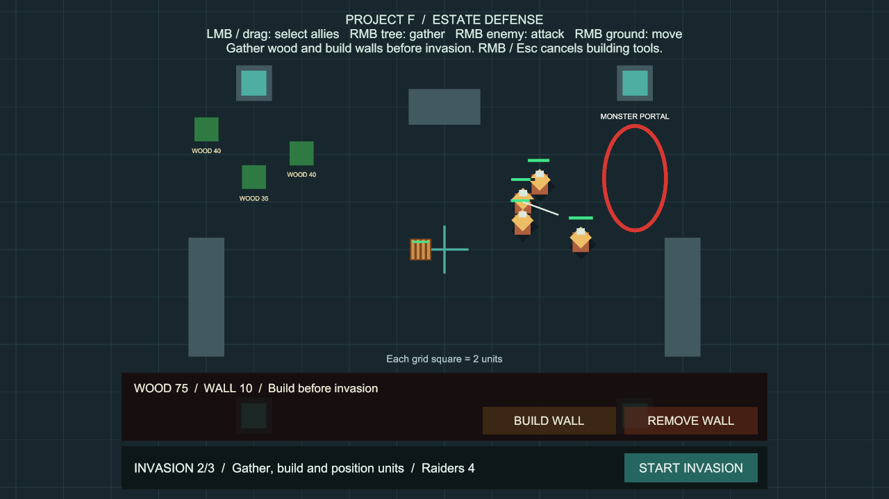
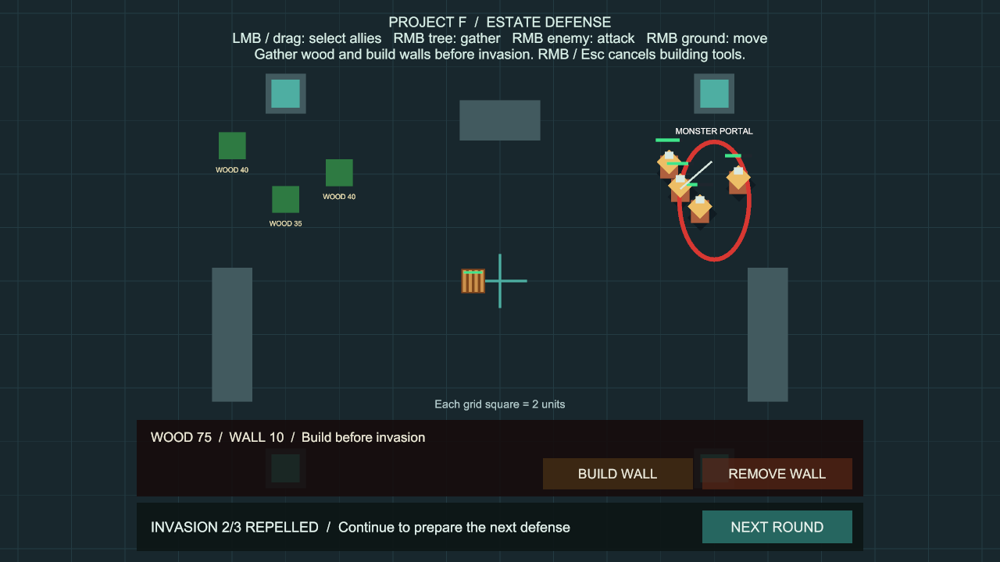
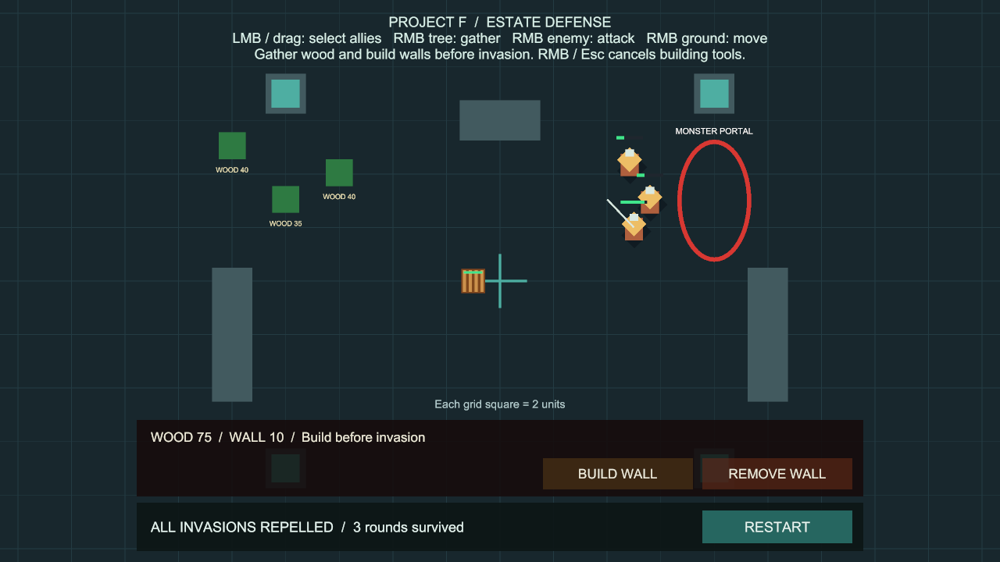

# 반복 침공과 다음 차수 준비

상태: 사용자 승인 완료. 구현 `aa8470a`, main 병합 `fc016ca`, GitHub 반영 완료.

후속 [병력 충원](UnitRecruitment.md)에서 준비 단계의 기본 병사 훈련을 추가했습니다.

## 플레이 방법

**Project F → Open Gameplay → Play**로 실행합니다. 추가 준비는 없습니다.

1. 아군을 배치하고 목재를 채집해 방어벽을 짓습니다. 하단에 현재 차수와 예정된 적 수가 표시됩니다.
2. **START INVASION**으로 1차 침공을 시작하고 적을 우클릭해 공격 명령을 내립니다.
3. 적을 모두 격퇴하면 **NEXT ROUND**를 누릅니다. 같은 영지에서 다음 침공의 준비 상태가 됩니다.
4. 채집·건설·철거를 다시 할 수 있습니다. 준비가 되면 **START INVASION**을 누릅니다.
5. 기본 **3차 침공**을 모두 격퇴하면 `ALL INVASIONS REPELLED`가 표시됩니다. 마지막 승리 또는 패배·취소 후 **RESTART**로 처음부터 다시 시작합니다.

기본 적 수는 **3명 → 4명 → 5명**입니다. 격퇴 후 다음 침공이 자동으로 시작되지 않습니다.

## 유지되는 것과 초기화되는 것

| 다음 차수 준비 시 유지 | 다음 차수 준비 시 초기화 |
| --- | --- |
| 살아남은 아군과 현재 체력·위치 | 해당 차수 생성 수·활성 적 수 |
| 사망한 아군의 사망 상태 | 포탈 출구 순서·막힘 표시 |
| 벽 위치·남은 체력·철거 환급액 | 생성·병력 점검 타이머 |
| 목재 재고와 각 나무의 잔량 | 다음 차수의 예정 적 수 |

무료 회복·부활·목재 보상·나무 재생은 없습니다. **RESTART**는 씬 전체를 다시 불러와 아군·벽·나무·자원을 처음 상태로 되돌립니다.

격퇴 결과 화면에서는 준비 행동이 잠겨 있습니다. **NEXT ROUND**로 Ready 상태에 돌아온 후 채집·건설·철거를 재개합니다. 다음 침공을 시작하면 다시 잠깁니다.

## 설정과 구현

Play를 멈추고 **Project F → Select Invasion Settings**에서 조절합니다.

| 설정 | 현재 에셋 값 | 범위 / 용도 |
| --- | --- | --- |
| Unit Count | 3 | 첫 차수 병력, 1~32 |
| Wave Count | 3 | 침공 차수, 1~10 |
| Additional Units Per Wave | 1 | 차수마다 증가할 병력, 0~32 |
| Preparation Seconds | 3초 | START INVASION 후 생성까지의 시간 |
| Spawn Interval | 1.5초 | 병력 생성 간격 |

차수별 병력은 `첫 병력 + 증가량 × (차수 - 1)`이며 최대 32명입니다. 차수 수·첫 병력·증가량은 첫 침공 시작 시 확정됩니다. 진행 도중 설정 에셋을 바꿔도 확정된 편성은 바뀌지 않습니다. 새 설정 인스턴스의 Wave Count 기본값은 1이라 기존 단일 침공 구성도 지원합니다.

- `PortalInvasion`이 차수와 전환을 소유하며 기존 생성·적 정리·승패 판정을 재사용합니다. 별도 전역 관리자나 씬 재로딩으로 중간 차수를 구현하지 않습니다.
- `PrepareNextWave()`는 격퇴했고 다음 차수가 있으며 남은 적이 없을 때만 Ready로 전환합니다. 일시정지·중복 요청·진행 중·최종 승리·패배·취소에서는 전환되지 않습니다.
- 격퇴 후 생존 아군이 사라졌다면 다음 준비 요청은 패배로 전환합니다. 중간 격퇴 상태에서 침공 시스템을 비활성화해도 시리즈는 취소됩니다.
- 기존 채집·건설 컴포넌트는 침공의 Ready 상태와 Changed 이벤트를 그대로 사용합니다. 상태 판단을 복제하지 않았습니다.
- HUD는 상태 변경과 준비 카운트다운의 정수 초 변화 때만 갱신합니다. 새 매 프레임 전체 검색이나 병력 목록 복사는 없습니다.
- 이번 기능은 수동으로 준비하는 유한 차수 방어입니다. 캠페인 날짜·자동 침공 일정·포탈 성장·다중 포탈·병종별 웨이브·치유·수리·저장은 후속 기능입니다. 세 차수의 장기 밸런스는 프로토타입 값입니다.

## 검증

검증 환경: Unity 6000.6.0f1, Windows x64, `BasicCombat`. 2026-10-07 (Asia/Seoul).

### Play 화면 확인

- 기본 설정·기본 체력·기본 공격력으로 3→4→5명 생성과 실제 전투 격퇴를 확인했습니다. 임시 검증 콜백은 기존 `UnitCombat.Attack` 명령만 내려 집중 공격했습니다. 체력이나 피해량을 바꾸지 않았고, 콜백은 Play 종료 시 제거했습니다.
- 목재 80에서 5를 채집하고 벽 한 칸을 지어 75가 됐습니다. 2차 준비에서 목재 75·나무 잔량 35·벽 한 칸과 아군 체력 100/80/90/80이 유지됐습니다.
- 2차 격퇴 후 체력 80/60/90/40, 최종 3차 격퇴 후 생존자 3명과 체력 30/30/90, 목재 75를 확인했습니다. 손실된 병력은 돌아오지 않았습니다.
- 1280×720 화면에서 준비·중간 격퇴·최종 격퇴 문구와 버튼이 겹치지 않는 것을 확인했습니다.

### 자동 검사와 빌드

- 반복 침공 전용 PlayMode 검사 10개 통과(8.90초). 차수별 생성, 자원·체력 유지, 실제 버튼 입력, 중복·일시정지 방지, 패배·취소·최종 재시작, 편성 확정·상한·단일 차수 호환을 검사했습니다.
- 전체 `ProjectF.PlayModeTests` **133개 통과**, 실패·건너뜀·판정 불가 0개, **199.44초**. 기존 123개와 새 10개를 포함합니다. 결과: `Logs/invasion-rounds-tests-final.json`.
- 처음 두 실행은 검사 도구의 남은 실행 상태 때문에 0개로 끝났습니다. 스크립트 재로드로 도구 상태를 초기화하고 실제 133개를 실행한 최종 결과만 통과 근거로 사용했습니다.
- 테스트 필터: PlayMode / assembly `ProjectF.PlayModeTests`. 패키지나 프로젝트 설정 변경 없이 수행했습니다.
- Windows x64 빌드 **Succeeded**, 오류 **0개**, 기존 경고 **501개**, **15.306초**, **132,828,770바이트**. 결과: `Logs/invasion-rounds-build-final.json`. 경고는 AI inference 셰이더 500건과 Player용 Pipeline 설정 안내 1건입니다.
- 실행 파일 `Builds/InvasionRounds/ProjectF_InvasionRounds.exe`를 화면 없이 실행해 엔진·입력 초기화와 프로세스 유지를 확인했습니다. 시작 로그 오류·예외 0개. 로그: `Logs/InvasionRounds-player.log`. 검사로 실행한 프로세스만 종료했습니다.
- 누락 스크립트·침공 필수 참조·메타 누락·중복 GUID 0개, EventSystem 1개. 최종 BasicCombat 씬은 저장된 상태로 열어두고 Play·일시정지를 해제했습니다.
- 화면·3차 전투는 Editor Play에서 검증했고 독립 실행 파일은 시작 검사만 수행했습니다. 대규모 전투 성능과 장기 캠페인 밸런스는 이번 검증 범위에 포함하지 않았습니다.
