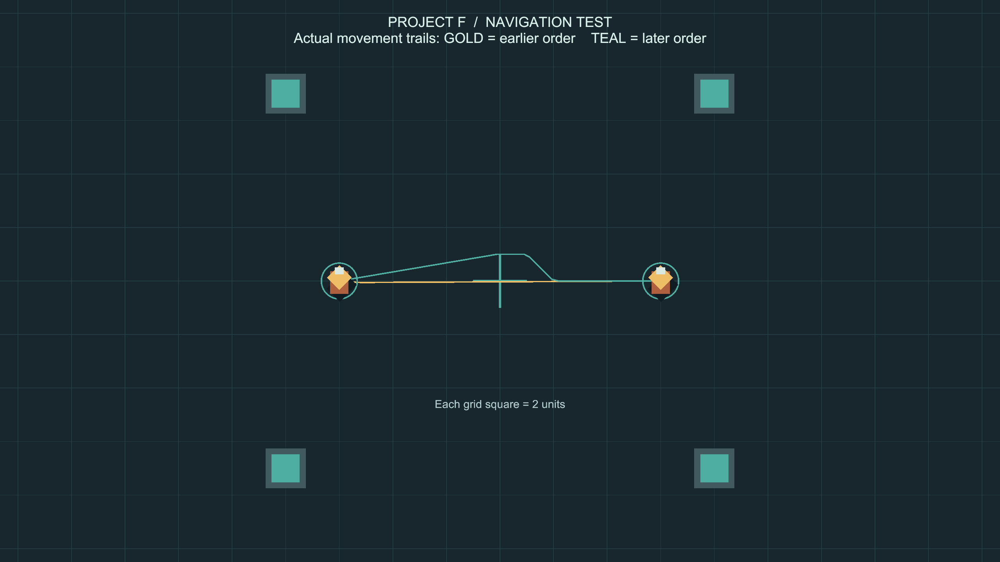

# 유닛 길찾기와 이동 우선권

이번 단계는 기존 마우스 선택·이동 기능 위에 장애물 우회와 유닛 간 충돌 회피를 추가합니다. 새 이동 명령을 내리는 조작은 이전과 같습니다.

## 동작 규칙

1. 이동 명령마다 순서를 부여합니다. 먼저 받은 명령을 우선해서 경로를 계산합니다. 이동 중 새 명령을 내리면 새로운 순서로 처리합니다.
2. 각 유닛이 앞으로 지나갈 위치와 시간을 예약합니다. 경로가 교차하더라도 통과 시각이 다르면 그대로 진행할 수 있습니다.
3. 나중 유닛은 먼저 예약된 경로를 피하거나 잠시 기다립니다. 안전한 우회가 성립하지 않으면 먼저 유닛의 경로도 다시 계산합니다. 우선권이 충돌을 허용하지는 않습니다.
4. 기본적으로 0.5초마다 현재 위치에서 경로를 다시 계산합니다. 먼저 유닛이 지나가거나 장애물이 없어지면 이전 우회를 계속 고집하지 않습니다.
5. 정지한 유닛은 장애물처럼 취급합니다. 임의로 밀어내지 않습니다.
6. 같은 목적지를 여러 유닛이 받으면 선착순으로 주변 도착 위치를 나눕니다. 목적지가 벽 안이면 가까운 빈 공간을 찾습니다.
7. 길이 완전히 막힌 경우 접근 가능한 곳에서 기다립니다. 장애물이 사라지면 같은 명령으로 다시 이동을 시도합니다. 가까운 대체 목적지조차 찾을 수 없으면 명령을 거부하고 멈춥니다.

## 기술 구성

- `NavigationGrid2D.cs`: 지도 범위 안에 길찾기 격자를 만들고, 유닛 몸통의 반경을 고려해 2D 충돌체를 검사합니다. 트리거와 등록 유닛은 지형에서 제외합니다. 격자의 연결 결과를 공유해서 같은 지형 검사를 반복하지 않습니다.
- `CooperativePathfinder.cs`: 위치뿐 아니라 도착 시간까지 고려한 A* 탐색입니다. 대기와 대각선 이동을 포함하며, 두 유닛이 서로 자리를 바꾸거나 이동 도중 경로가 교차하는 경우도 연속 구간으로 검사합니다.
- `NavigationWorld2D.cs`: 씬 안의 유닛 등록, 명령 순서, 경로 예약, 정기 재탐색과 실제 다음 물리 이동의 안전 검사를 담당합니다.
- `CommandableUnit.cs`: 기존 선택과 목적지 표시를 유지하면서 이동 속도를 길찾기 시스템에서 받습니다. 요청한 목적지와 실제 배정된 목적지, 이동 상태를 구분합니다.
- `NavigationTests.cs`: 마주 오는 이동, 교차 이동, 벽 우회, 정지 유닛, 좁은 통로, 장애물 제거, 중복 목적지와 다수 유닛을 검사합니다.

파일은 `Assets/ProjectF/Runtime/Player/`와 `Assets/ProjectF/Tests/PlayMode/` 아래에 있습니다. 경로 예약은 씬의 `Mouse Commands` 오브젝트에 있는 `Navigation World 2D` 컴포넌트가 관리합니다. 별도 패키지는 추가하지 않습니다.

## 직접 시험하기

1. **Project F → Open Mouse Command Test → Play**로 실행합니다. 시험장에 회색 장애물 3개를 추가해 두었습니다.
2. 유닛 하나를 좌클릭하고 회색 벽 반대편 땅을 우클릭합니다. 벽 끝을 돌아서 도착하는지 확인합니다.
3. 유닛 두 개를 충분히 떨어진 위치에 놓습니다. 첫 유닛을 반대편으로 보내고, 다른 유닛도 그 반대 방향으로 보냅니다. 서로 밀며 멈추지 않고 지나가는지 확인합니다.
4. 네 유닛을 드래그 선택해 벽 반대편으로 보냅니다. 각 유닛이 다른 경로를 사용할 수 있지만 모두 목적지로 향해야 합니다.
5. 장애물 제거를 시험하려면 Play 중 Hierarchy의 `Navigation Obstacles` 아래 벽 하나를 비활성화합니다. 최대 약 1초의 지형 갱신 후 새 경로를 사용합니다. Play를 종료하면 임시 변경은 원래대로 돌아옵니다.

장애물을 추가하려면 `BoxCollider2D`, `CircleCollider2D` 등 2D 충돌체를 붙이고 **Is Trigger를 끕니다**. 그림만 놓으면 이동을 막지 않습니다. 시험장은 XY 평면을 사용하며 3D Collider는 이 길찾기의 대상이 아닙니다. 시험 벽을 삭제한 후 다시 만들려면 **Project F → Add Navigation Test Obstacles**를 사용할 수 있습니다.

## 범위와 조정

현재 시험장은 이동 가능 중심 좌표 X -23~23, Y -15~15입니다. 기본 격자는 월드 1단위, 예약 시간 간격은 0.1초, 예측 범위는 6초입니다. 더 긴 이동은 현재 위치에서 계속 이어서 계산합니다. 이동 속도는 기존 `LordMovementSettings.asset` 값을 최대 속도로 사용합니다.

이후 집결 이동 단계에서 도착 위치 탐색의 반경 4 제한을 제거하고, 몸통 크기별 지형 캐시·시간/공간별 경로 예약 검색·인원수에 따른 탐색량 배분을 추가했습니다. 최신 설명과 검증은 [집결·병력 규모 안내](GroupMovement.md)를 확인하세요.

매 프레임 전체 경로를 새로 만들지 않습니다. 탐색 배열과 경로 버퍼를 재사용하고, 탐색 횟수에 상한을 둡니다. 정적 지형 정보는 공유하며 장애물은 이동 중 기본 1초 간격으로 갱신합니다. 건설·철거 기능을 붙일 때는 변경 직후 `MarkObstaclesDirty()`를 호출하면 됩니다. 갱신 전에도 다음 이동 구간을 물리 검사해서 새 장애물을 통과하지 않도록 합니다.

시간·격자·탐색량을 제한한 방식이므로 모든 배치에서 수학적인 최단 경로나 모든 유닛의 최적 통행 순서를 보장하는 시스템은 아닙니다. 격자보다 더 세밀한 통로나 밀집된 대규모 군대는 별도 검증과 조정이 필요합니다. 공간이 없어 물리적으로 지나갈 수 없는 배치는 안전하게 기다리도록 처리합니다.

## 검증 결과

- Unity `6000.6.0f1`, Windows PC, `Input_Camera` 브랜치.
- 최종 PlayMode 테스트 **23개 통과, 실패 0, 건너뜀 0**. 길찾기 13개와 기존 마우스·카메라 10개이며 약 50.45초가 걸렸습니다.
- 마주 오는 두 유닛, 네 방향 교차, 몸통 크기를 고려한 벽 우회, 정지 유닛을 밀지 않기, 좁은 통로, 한 줄짜리 통로에서 후퇴 후 통과, 근접 배치에서 분리, 같은 목적지의 도착 위치 분산, 장애물 안의 목적지 보정, 장애물 제거 후 경로 단축, 완전히 막힌 길에서 대기 후 복구, 실행 중 유닛 등록, 16개 유닛의 맞교환 이동을 확인했습니다.
- 16개 유닛의 같은 맞교환 테스트에서 계산 중 반복적인 Unity 위치·반경 접근을 캐시로 교체했습니다. 에디터에서 경로 재계산 1회 평균은 **13.49ms → 4.06ms**, 최대는 **31.63ms → 9.59ms**였습니다. 양쪽 실행 모두 재계산 7회, 충돌 방지용 강제 정지 0회이며 모든 유닛이 도착했습니다. 전체 프레임 시간이나 다른 PC·대규모 전투의 성능을 보장하는 수치는 아닙니다.
- 검사 원본: `Logs/navigation-tests-final.json`. 비교 전: `Logs/navigation-regression-first.json`. Git 제외 대상입니다.
- Windows x64 빌드 성공: 오류 0개, 약 14.11초. 실행 파일은 `Builds/InputCamera/ProjectF_InputCamera.exe`입니다. Windows에서 시작과 프로세스 응답, 입력·물리 초기화를 확인했으며 시작 로그에 게임 코드 예외가 없었습니다. 별도 실행 파일의 마우스 조작은 자동 검증하지 않았고, 이동 시나리오는 에디터 PlayMode에서 검사했습니다.
- 기존 패키지 빌드 경고 501건은 유지됩니다: AI inference 셰이더 500건과 Pipeline 원격 제어가 Player에서 비활성화된다는 안내 1건. 새 컴파일 오류나 테스트 실패는 없습니다.
- 최종 씬: 누락 스크립트 0개, 유닛 4개의 길찾기 참조 정상, 시험 장애물 3개. 캡처용 임시 궤적 오브젝트는 저장된 씬에 남아 있지 않습니다.
- 빌드 보고서 `Logs/navigation-build-report.json`, 실행 로그 `Logs/Navigation-player.log`. 에디터 Play와 시험 실행 파일은 종료한 상태이며 커밋·푸시·main 병합은 하지 않았습니다.

## 실제 이동 궤적

실제 Play Mode에서 서로 반대편으로 이동시킨 뒤 기록한 궤적입니다. 금색은 먼저 명령받은 유닛, 청록색은 나중 유닛입니다. 설명을 위해 검사 중에만 궤적선을 추가했습니다. 기본 게임 화면에 경로선이 표시되는 기능은 아닙니다.
