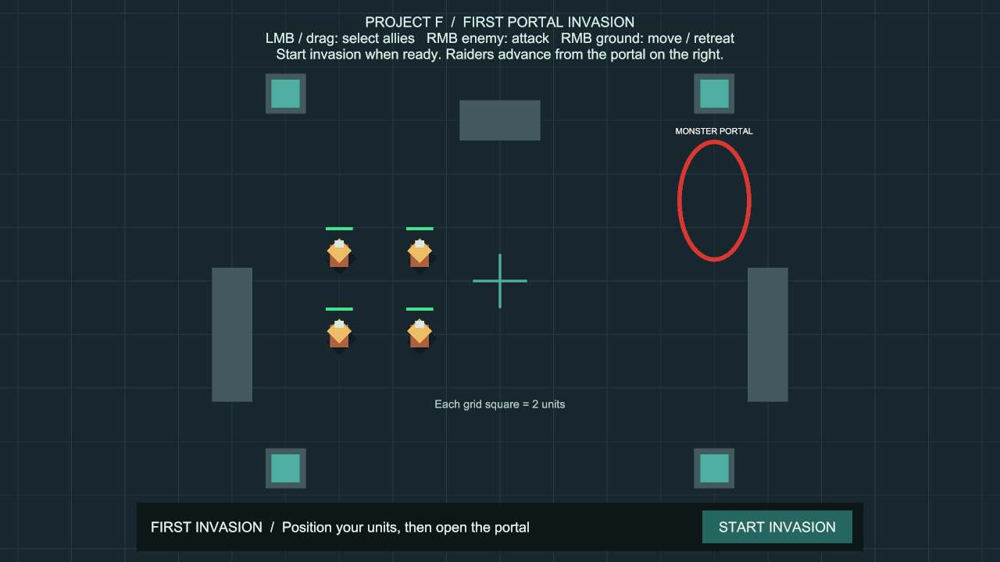
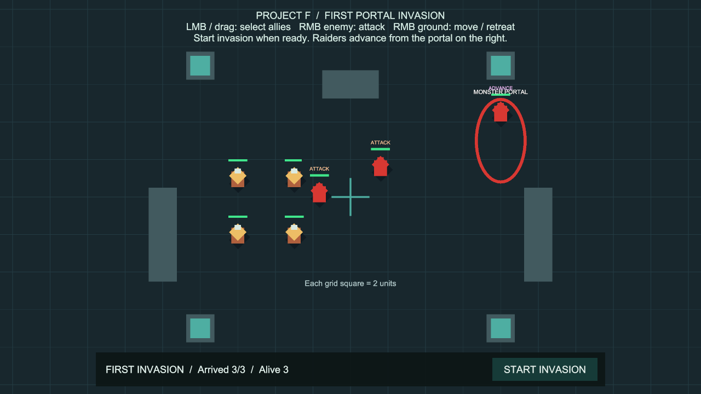
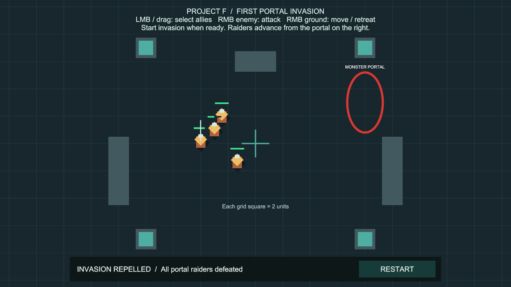

# 포탈 생성과 첫 침공

상태: 사용자 승인·main 병합 완료 (`7d35131`). 후속 [방어벽 건설](WallBuilding.md)이 같은 플레이 씬에 통합됐습니다.

이 문서는 최초 1회 침공 구현의 기록입니다. 현재 플레이 흐름은 [반복 침공·다음 차수 준비](InvasionRounds.md)를 따릅니다. 중간 격퇴는 NEXT ROUND, 최종 승리·패배·취소는 RESTART를 사용합니다.

## 실행과 조작

추가 에셋 설치나 Inspector 연결은 필요하지 않습니다.
**Project F → Open Gameplay → Play**로 기존 `BasicCombat` 플레이 씬을 실행합니다.

1. 금색 아군 4명을 좌클릭 또는 드래그로 선택하고 땅을 우클릭해 배치합니다.
2. 화면 아래 **START INVASION**을 누릅니다. 3초 뒤 오른쪽 포탈에서 몬스터 3명이 1.5초 간격으로 등장합니다.
3. 몬스터는 왼쪽 아군 진영으로 진격합니다. 가까운 아군을 발견하면 스스로 교전합니다.
4. 아군을 선택하고 빨간 몬스터를 우클릭해 공격합니다. 아군에게는 직접 공격 명령을 내려야 합니다. 땅 우클릭은 이동·후퇴입니다.
5. 등장할 몬스터가 모두 나온 뒤 살아 있는 침공 몬스터가 0명이 되면 **INVASION REPELLED**가 표시됩니다.
6. 아군 4명을 모두 잃으면 **DEFEAT**가 표시되고 추가 생성과 적 명령이 멈춥니다.
7. 결과 화면의 **RESTART**는 현재 씬을 다시 불러옵니다. 체력과 배치, 침공 진행이 초기화됩니다.

아래의 `Arrived`는 이번 침공에서 등장한 수, `Alive`는 살아 있는 침공 몬스터 수입니다.
이 단계는 포탈 하나에서 발생하는 수동 시작 1회 침공입니다. 캠페인 시간이나 정찰 정보에 따른 침공 발동은 아직 연결하지 않았습니다.

## 몬스터 행동

| 표시 | 행동 |
| --- | --- |
| ADVANCE | 지정된 침공 목적지로 진격하면서 주변 아군을 탐지 |
| ATTACK | 발견한 아군을 추격·공격 |
| GUARD | 목적지에 도착한 뒤 주변을 경계 |
| RETURN | 기존 경계형 적이 원래 경계 지점으로 복귀할 때 사용 |

- 진격 중 상대를 잃거나 시야·추적 한계를 넘으면 진격을 재개합니다. 교전 시작 지점을 기준으로 추적 범위를 제한합니다.
- 목적지에 도달하면 실제 도착 위치를 경계 지점으로 삼습니다. 여러 몬스터가 같은 목적지로 이동하면 길찾기가 배정한 주변의 빈 도착 위치를 인정합니다. 이후에는 기존 경계·복귀 규칙을 따릅니다.
- 경로가 막히면 기존 길찾기의 대기·재계산 규칙을 따릅니다. 목적지에 도달하지 못한 경우 일정 간격으로 다시 명령하며 순간이동하지 않습니다.
- 포탈의 출구 3곳을 물리 검사합니다. 모두 막혔다면 **PORTAL EXIT BLOCKED**로 기다리고, 막힌 시도는 생성 수에 포함하지 않습니다.
- 체력과 공격, 충돌 회피는 기존 시스템을 그대로 사용합니다. 진격·복귀가 체력을 회복시키지 않습니다.

## 설정 변경

Play를 멈춘 상태에서 **Project F → Select Invasion Settings**를 선택합니다.

| 설정 | 기본값 | 의미 |
| --- | --- | --- |
| Unit Count | 3 | 이번 1회 침공의 총 몬스터 수. 현재 1~32로 제한 |
| Preparation Seconds | 3 | 시작 버튼 이후 첫 등장까지 기다리는 시간 |
| Spawn Interval | 1.5 | 성공한 생성 사이의 간격(초) |
| Blocked Retry Interval | 0.5 | 출구가 막혔을 때 재검사 간격(초) |

설정 에셋: `Assets/ProjectF/Data/FirstInvasionSettings.asset`.
총 병력 수는 씬 시작 시 고정됩니다. 수치를 바꾼 뒤 Stop → Play로 다시 시작합니다.
일시정지와 생성·AI 타이머는 게임 시간에 맞춰 함께 멈춥니다.

- 재사용 몬스터: `Assets/ProjectF/Prefabs/PortalRaider.prefab`. 비활성 상태를 유지해야 하며, 생성 코드가 길찾기 연결 후 활성화합니다.
- 체력·공격력: 기존 `EnemyCombatSettings.asset`.
- 시야·교전 판단 간격: 기존 `EnemyAISettings.asset`.
- 위치: 씬의 `Portal Invasion/Portal/Exit 1~3`, `Portal Invasion/Invasion Destination`. 출구는 지도 안의 빈 공간에 둡니다.
- `Project F → Setup → Add First Portal Invasion`은 초기 통합용 메뉴입니다. 평소 실행은 **Open Gameplay**를 사용합니다.

## 코드 구조와 유지보수

- `PortalInvasion`: 유한 웨이브의 상태·생성·구성원 수·종료 판정 소유. UI와 입력 코드를 포함하지 않습니다.
- `InvasionSettings`: 공유 설정. 런타임 진행 상태를 에셋에 쓰지 않습니다.
- `InvasionHUD`: 상태 표시와 버튼. 상태 변화 이벤트와 준비 시간의 초 단위 변화에만 문구를 갱신합니다.
- `EnemyCombatAI.AdvanceTo`: 기존 AI에 진격 명령을 추가합니다. 기존 경계형 행동과 전투·이동 실행기는 유지합니다.
- `CommandableUnit.InitializeNavigation`: 비활성 프리팹을 해당 씬의 중앙 길찾기에 연결한 뒤 활성화합니다.
- 사망 시 생성된 유닛을 제거하며, 외부 비활성화·파괴도 0.25초 간격으로 정리합니다. 침공 컴포넌트를 비활성화하면 소유한 몬스터를 정리하고 취소합니다.
- 기존 배치형 적 3명은 프리팹으로 전환했습니다. 이전 전투·AI 테스트는 `CombatTestScene`에서 이 실제 프리팹을 생성해 동일한 검사를 유지합니다.
- 새 플레이 씬이나 별도 전투 시스템을 추가하지 않았습니다. 빌드 시작 씬은 계속 `BasicCombat`입니다.
- uGUI 버튼용 `GraphicRaycaster`와 새 Input System UI 모듈을 기존 HUD에 연결했습니다. UI 위 클릭은 기존 월드 명령 처리에서 차단됩니다.

## 성능 범위

- 생성은 지정 간격마다 최대 1명입니다. 느린 프레임 뒤 한 번에 몰아서 생성하지 않습니다.
- 출구 검사와 생존자 목록은 재사용합니다. 매 프레임 전역 오브젝트 탐색이나 목록 재생성이 없습니다.
- AI는 기존 0.25초 판단 간격과 물리 근접 조회를 사용합니다. 추가 생성된 유닛도 같은 중앙 길찾기에 등록됩니다.
- 이번 3명 규모에서 필요하지 않은 오브젝트 풀은 도입하지 않았습니다. 반복 대규모 웨이브를 추가할 때 생성 비용 측정과 체력·AI 초기화 계약을 함께 검토해야 합니다.
- 32명 설정 상한은 대규모 전투 성능 보장이 아닙니다. 수백~수천 명 전투와 프레임 예산은 아직 검증 범위 밖입니다.

## 검증

- 전체 PlayMode **68개 통과, 실패·건너뜀 0개**, 145.43초. 기존 이동·카메라 29개, 전투 14개, 경계 AI 13개, 침공 12개. `Logs/invasion-tests-final.json`, `Logs/invasion-full-68.xml`.
- 이후 포탈 표시를 장애물과 겹치지 않게 옮긴 최종 씬에서도 **침공 12개 통과**, 22.71초. `Logs/invasion-layout-tests-final.json`.
- 검증 중 공유 목적지에 집결한 적이 주변 도착 위치를 인정하지 않는 문제를 수정했습니다. 같은 지점으로 진격하는 세 몬스터의 도착·정착 검사를 추가했습니다.
- 시작 대기, 중복 시작 차단, 독립 체력, 길찾기 등록, 진격 중 탐지·대상 사망 후 진격 재개, 실제 아군 피해, 출구 차단·해제, 일시정지, 모든 몬스터 등장 전 성급한 승리 방지, 격퇴·패배, 비활성화·외부 파괴 정리를 검증했습니다.
- 입력 검사는 가상 마우스로 실제 uGUI 시작·재시작 버튼을 누르며, UI 클릭이 월드 선택으로 전달되지 않는지 확인합니다.
- Play 화면에서 기본 설정으로 3명 등장·진격·교전을 확인했습니다. 임시 검증 콜백에서 기존 `UnitCombat.Attack` 명령을 아군에게 내려 실제 전투로 3명을 처치했습니다. 직접 체력 변경 없이 아군 4명 생존, 체력 100/100/80/50, 상태 `Repelled`, 잔여 적 0을 확인했습니다. 콜백은 Play 종료와 함께 제거되며 프로젝트 코드에 포함하지 않았습니다.
- 재시작으로 초기 아군 4명과 준비 상태 복구, 누락 스크립트 0개, EventSystem 1개, 메타 누락·중복 GUID 0개를 확인했습니다.
- 씬은 Unity 에디터로 편집했습니다. 기존 직렬화 오브젝트 493개의 식별자를 유지했고, 그중 기존 내용 변경은 HUD·HUD 자식 목록·씬 루트 목록 4개였습니다. 기존 배치 적의 제거와 침공/UI 추가가 나머지 변경입니다.
- 저장된 씬을 Play 종료·일시정지 해제 상태로 남깁니다. 검사 중단 뒤 도구가 잘못 남긴 진행 상태는 스크립트 재로드로 초기화하고, 실제 검사 수가 12인 완료 결과만 최종 검증으로 인정했습니다.
- Windows x64 빌드 성공, 오류 0개, 14.543초, 132,780,494바이트. 실행 파일은 `Builds/PortalInvasion/ProjectF_PortalInvasion.exe`, 결과는 `Logs/invasion-build-final.json`입니다.
- 빌드 경고 501개는 이전 단계와 같은 종류입니다. AI inference 셰이더 경고 500개와 Player에서 Pipeline 원격 제어가 비활성이라는 안내 1개입니다. 이번 기능을 위해 패키지나 그래픽·물리 설정을 변경하지 않았습니다.
- 생성된 Windows 실행 파일을 `-batchmode -nographics`로 실행해 엔진·Input System 초기화, 프로세스 유지와 예외 없는 시작을 확인했습니다. `Logs/PortalInvasion-player.log`. 검사 프로세스는 종료했습니다. 독립 실행 파일의 실제 마우스·렌더링은 별도로 검증하지 않았으며, 그 검사는 에디터 Play에서 수행했습니다.

## 현재 범위

포탈 성장·파괴·봉인, 복수 웨이브, 캠페인 시간, 정찰 정보, 보상·경제, 성이나 영지의 체력, 저장·불러오기는 포함하지 않습니다.
아군 전멸을 이번 단계의 패배 조건으로 사용합니다. 몬스터와 포탈의 외형, 영어 HUD는 현재 개발용 표시입니다.
