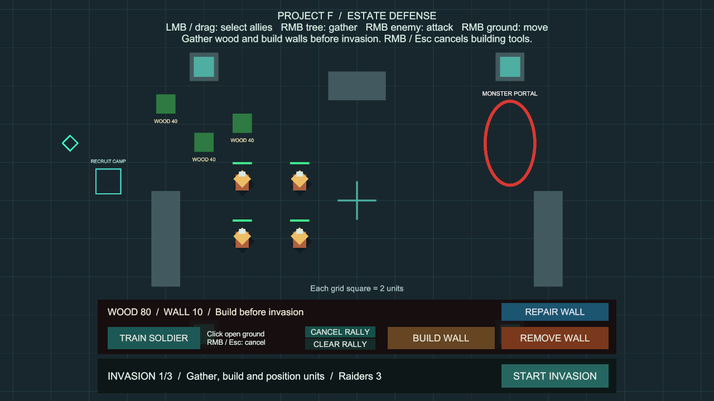
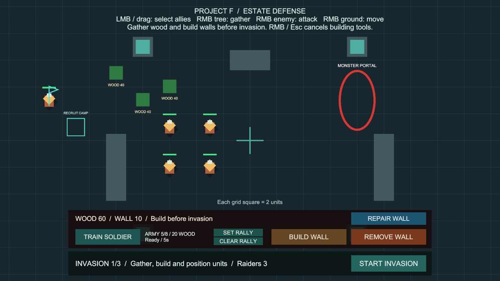

# 훈련소 집결 지점

상태: 구현·검증 완료, 사용자 확인 대기. 브랜치 `codex/recruitment-rally`, 승인된 방어벽 수리의 main 병합 `b8ad011`에서 분기했습니다. 사용자 확인 후 main에 병합합니다.

## 플레이 방법

추가 준비 없이 **Project F → Open Gameplay → Play**로 실행합니다.

1. 준비 단계에서 **SET RALLY**를 누릅니다.
2. 이동 가능한 지도 안의 빈 땅을 가리킵니다. 초록색 미리보기는 지정 가능, 빨간색은 장애물·지도 경계 등 지정 불가입니다.
3. 좌클릭하면 깃발이 놓이고 지정 모드가 끝납니다.
4. **TRAIN SOLDIER**로 병사를 충원합니다. 기존처럼 목재 20과 준비 시간 5초를 사용하고, 출구에 나온 새 병사가 깃발로 이동합니다.
5. **SET RALLY**로 위치를 바꾸거나 **CLEAR RALLY**로 해제할 수 있습니다. 지정 중 우클릭·Esc·**CANCEL RALLY**는 변경을 취소하고 이전 지점을 유지합니다.

집결 지점 지정·변경·해제에는 자원이 들지 않습니다. 해제하면 이후 병사는 훈련소 출구에서 기다립니다.

## 규칙과 범위

- 한 훈련소에 지점 하나를 보관합니다. 현재 프로젝트의 고정 훈련소에 연결했습니다.
- **병사가 실제 배치되는 순간의 지점**을 사용합니다. 훈련 중이나 출구가 막혀 대기하는 동안에도 지점을 바꿀 수 있습니다.
- 이미 나온 병사는 지점 변경·해제로 다시 명령받지 않습니다. 플레이어의 이동·공격·채집 명령을 그대로 유지합니다.
- 지도 경계 밖, 숫자가 아닌 좌표, 나무·벽·지형 안은 지정할 수 없습니다. 다른 병사가 있는 곳은 허용하고 기존 길찾기가 서로 다른 도착 위치를 배정합니다.
- 지정 후 벽이 생기면 기존 길찾기가 주변 도착 위치와 우회 경로를 찾습니다. 출구 전체가 막히면 기존 훈련소 규칙대로 배치를 기다립니다. 길이 완전히 막히면 자동 집결도 기존 이동과 같이 대기할 수 있으므로 통로를 확보해야 합니다. 지정 시 목적지 주변만 검사하며 경로 전체의 연결을 보장하지는 않습니다.
- 침공·결과·일시정지에서는 설정과 해제를 잠급니다. 집결 지점은 다음 차수 준비까지 유지합니다. 준비 상태에서 출발한 병사의 이동은 침공 시작 후에도 기존 명령으로 계속됩니다.
- 재시작하면 지점과 지정 모드를 초기화합니다. 파일 저장, 여러 지점 경유, 공격 이동, 자동 채집, 부대 편성은 이번 기능에 포함하지 않습니다.
- 건설·철거·수리와 집결 지정은 동시에 켜지지 않습니다. UI 위·화면 밖·카메라 이동 중의 클릭을 보호하며, 취소 클릭이 기존 병사의 이동으로 전달되지 않습니다.

## 코드와 유지보수

- `UnitRecruitment`: 집결 지점과 설정 검증의 소유자입니다. 배치 직후 `CommandableUnit.MoveTo`를 한 번 호출해 기존 전투·채집 취소와 중앙 길찾기를 재사용합니다.
- `NavigationWorld2D.MovementBounds`: 기존 이동 경계를 읽기 전용으로 제공합니다. 별도 지도 경계를 중복 저장하지 않습니다.
- `RecruitmentRallyController`: 입력·지정 모드·깃발·미리보기만 담당합니다. 기존 `UnitCommandController`의 포인터 점유 API와 건설 상태 이벤트를 사용합니다.
- `RecruitmentRallyHUD`: 설정·해제 버튼과 안내를 이벤트로 갱신합니다. 훈련소 재활성화와 씬 종료 순서를 처리합니다.
- `RecruitmentRallySetup`: Unity API로 BasicCombat에 연결하는 반복 실행 가능한 에디터 메뉴입니다. 기존 훈련소 영역 안에 지정·해제 버튼을 배치합니다. 지정 중에는 훈련 상태 글자 자리에 클릭 안내를 표시하고 종료하면 훈련 상태를 복원합니다.
- 물리 조회 배열·MaterialPropertyBlock·기존 재질을 재사용합니다. 마우스가 정지하면 0.1초 간격으로 미리보기를 검사하고 클릭 시 다시 검증합니다. 매 프레임 씬 검색·경로 재생성·새 관리자를 추가하지 않습니다.
- 런타임 지점은 공유 설정 에셋을 변경하지 않습니다. 훈련 비용·시간·상한과 출구 검사는 기존 규칙을 유지합니다.

## 검증

Unity 6000.6.0f1 / Windows x64 / 기능·화면 검증 2026-10-08, 최종 빌드·정리 2026-10-09 (Asia/Seoul).

- 전용 검사는 기본 대기, 이동 완료·명령 1회, 훈련 중 지점 변경, 해제 후 기존 명령 유지, 경계·장애물 거부, 여러 병사의 도착 분산, 실제 버튼·깃발·클릭, 건설 도구 전환, 취소, UI·패닝 보호, 일시정지·재활성화, 차수 유지, 뒤늦게 생긴 장애물, 씬 재시작을 다룹니다.
- 첫 14개 검사 중 12개 통과, 2개 실패를 확인하고 훈련소 재활성화 알림·씬 종료 시 UI 참조를 수정했습니다. 실패 기록은 `Logs/rally-tests-first.json`에 보관합니다.
- 수정 후 전용 PlayMode **14개 통과**, 실패·건너뜀 0개, **10.60초** (`Logs/rally-tests-targeted.json`).
- 실제 기본 설정 Play에서 가상 마우스로 SET RALLY → (-15, 3) 좌클릭 → TRAIN SOLDIER를 눌렀습니다. 기본 5초 훈련 후 목재 80→60, 아군 4→5명, 새 병사의 (-15, 3) 도착(Arrived)을 확인했습니다. 임시 입력 장치를 제거하고 Play를 종료했습니다.
- 초기 화면 검사 후 전체 회귀 검사에서 추가 UI 행이 지도 선택·이동 클릭을 가리는 문제를 발견했습니다. 기존 훈련소 영역 안으로 버튼을 옮겨 지도에 덮는 영역을 늘리지 않도록 수정했습니다.
- 최종 UI에서 기본 설정의 지점 지정·5초 훈련·깃발 도착을 다시 확인하고 아래 화면을 교체했습니다. 지정 중 클릭 안내를 표시하며 종료 후 ARMY·훈련 상태 안내를 복원합니다.
- 배치 수정 후 집결 14개(10.60초), 기본 전투·벽 전투 29개(43.54초) 모두 통과했습니다. 기존 선택·이동 검사 조건은 유지했습니다.
- 전체 실행에서 반복된 벽 돌파 실패는 기존 검사의 도착 기준 오류였습니다. 진단 결과 적은 벽을 통과해 (-5.41, 0)에서 Guarding이었으며, 목표 (-6, 0)에 대한 실제 AI 허용 거리 0.6을 만족했습니다. 검사의 고정 조건 `x < -5.5`를 설정의 `ReturnTolerance`에 따른 거리 검사로 바로잡았습니다. AI 판단 지연을 0~0.24초의 13가지로 바꾸는 회귀 검사를 추가했습니다. 전투 런타임 동작은 변경하지 않았습니다.
- Git 병합 뒤 열린 씬의 외부 변경 확인 창 때문에 Unity 명령 3건이 시간 초과되었습니다. 저장된 씬을 다시 불러와 해결했으며 게임 코드의 컴파일 오류는 없었습니다.
- 최종 전체 PlayMode 검사 **174개 통과**(기존 159개 + 집결 14개 + 벽 돌파 판단 시점 회귀 1개), 실패·건너뜀·판정 불가 0개, **259.86초**. `Logs/rally-tests-final.json`에 완료된 원본 결과를 보관합니다.
- Windows x64 빌드 성공, **오류 0개**, **29.506초**, **132,860,882바이트**. 경고 501건의 유형은 이전 방어벽 수리 빌드와 동일합니다(AI inference 셰이더와 Player의 Pipeline 비활성화 안내).
- `Builds/RecruitmentRally/ProjectF_RecruitmentRally.exe`를 화면 없이 실행해 엔진·입력 초기화와 프로세스 유지를 확인했습니다. 시작 로그 오류·예외는 없었습니다. 게임 화면과 클릭 동작은 위 Editor Play 검사로 확인했습니다.
- 최종 `BasicCombat` 씬은 저장·Play 중지 상태입니다. 누락 스크립트 0개, 집결 입력·HUD의 참조 누락 0개, EventSystem 1개를 확인했습니다. 패키지와 프로젝트 설정 변경은 없습니다.
- 원본 결과는 `Logs/rally-tests-final.json`, `Logs/rally-build-final.json`, `Logs/RecruitmentRally-player.log`에 보관합니다. Logs와 Builds는 로컬 검사 산출물이며 Git에는 코드·검사·씬·문서·화면을 보관합니다.

