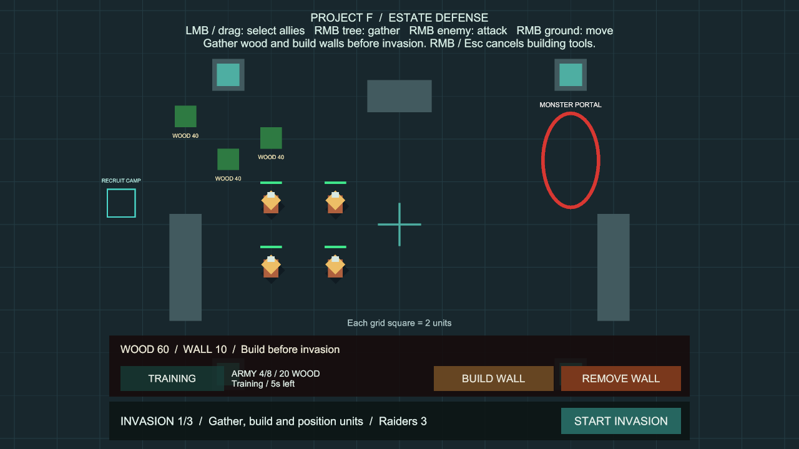
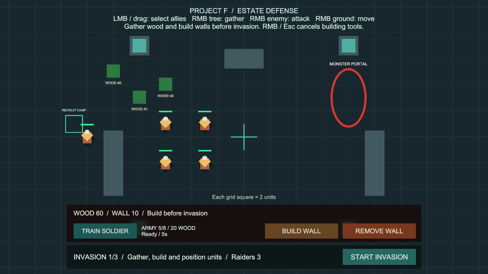

# 준비 단계의 병력 충원

상태: 사용자 승인 완료. 구현 `4094037`, main 병합 `09c0d14`, GitHub 반영 완료.

## 플레이 방법

추가 준비 없이 **Project F → Open Gameplay → Play**로 실행합니다.

1. 하단 왼쪽 **TRAIN SOLDIER**를 누릅니다. 목재 **20**을 즉시 소비하고 한 명의 훈련을 시작합니다.
2. 준비 상태에서 **5초**가 지나면 왼쪽 **RECRUIT CAMP** 주변에 기본 병사가 나옵니다. 초기 아군 4명에서 최대 **생존 아군 8명**까지 충원할 수 있습니다.
3. 새 병사도 좌클릭·드래그로 선택하고 땅·적·나무를 우클릭해 이동·공격·채집합니다.
4. 침공 중에는 훈련 시간이 멈춥니다. 격퇴 후 **NEXT ROUND**로 다음 준비에 들어가면 남은 시간을 이어갑니다. 비용은 다시 차감하지 않습니다.
5. 출구가 모두 막히면 `Clear the camp exits`가 표시됩니다. 주변 병사를 이동하거나 벽을 철거하면 빈 출구에 배치됩니다.

| 상황 | 동작 |
| --- | --- |
| 자원 부족·병력 상한·이미 훈련 중 | 새 훈련 시작 불가, 추가 비용 없음 |
| 침공·격퇴 결과·일시정지·훈련 컴포넌트 비활성화 | 진행 중인 훈련 시간 보관 |
| 다음 준비·일시정지 해제·컴포넌트 재활성화 | 기존 훈련 계속 |
| 훈련 완료 시 병력 상한 도달 | 자리가 생길 때까지 대기 |
| 새 병사만 생존 | 방어전 계속; 초기 배치 병력만으로 패배를 판단하지 않음 |
| 병사 사망 | 생존 병력 수에서 제외, 다음 준비에서 충원 가능 |
| RESTART | 새 병사·훈련·목재·침공을 포함한 씬 전체 초기화 |

훈련 슬롯은 하나이며 **수동 취소·환불은 제공하지 않습니다**. 최종 승리·패배·침공 취소 뒤에는 준비 단계가 없으므로 진행 중인 훈련도 재개되지 않습니다. RESTART로 처음부터 시작할 수 있습니다.

## 범위와 설정

기획서의 초기 생존기·군대 성장으로 이어지는 첫 병력 충원 단계입니다. 현재 있는 목재를 임시 훈련 비용으로 사용합니다. 고정된 훈련소와 기본 병사 하나를 제공하며, 건설 가능한 병영·식량·인구·금화·영웅별 지휘력·병종 승급은 후속 단계입니다. 현재 8명 상한은 프로토타입의 생존 아군 상한으로, 기획서의 영웅 지휘력 시스템을 대신하지 않습니다.

Play를 멈추고 **Project F → Select Recruitment Settings**에서 조절합니다.

| 설정 | 기본값 | 범위 / 의미 |
| --- | --- | --- |
| Wood Cost | 20 | 최소 1, 시작 시 한 번 차감 |
| Training Seconds | 5 | 최소 0.1초, 준비 상태의 게임 시간 |
| Maximum Allies | 8 | 1~64, 영주·초기 아군·충원 병사의 생존 수 합계 |

- 이미 결제한 훈련의 시간과 비용은 이후 설정 변경에 영향을 받지 않습니다. 병력 상한은 시작과 실제 배치 때 다시 검사합니다.
- 새 병사는 기존 아군 전투·이동·채집 설정을 공유하고 자신의 체력을 갖습니다. 기존 생존자의 체력이나 사망 상태를 변경하지 않습니다.
- 씬의 `Recruit Camp`에 출구 3개를 연결했습니다. 원형 물리 검사로 유닛·벽·지형과 겹치지 않는 출구를 고릅니다. 출구 재검사는 0.5초 간격입니다.
- 훈련소 표시는 임시 도형이며 공격·파괴 가능한 건물은 아직 아닙니다. 출구 예약이나 자동 집결도 없으므로 출구가 차면 병사를 직접 이동해야 합니다.

## 코드와 유지보수

- `RecruitmentSettings`: 비용·시간·병력 상한 설정.
- `UnitRecruitment`: 유료 슬롯·진행·출구 검사·생성·새 병사 사망 정리. 훈련 시작 시 슬롯을 먼저 잠가 자원 변경 이벤트의 중복 구매를 차단합니다.
- `RecruitmentHUD`: 기존 건설 패널의 빈 영역에 버튼과 병력 수·진행 안내 표시. 상태 변경, 정수 초 변화, 준비 가능 여부가 바뀔 때 갱신합니다.
- `PortalInvasion`: 기존 초기 방어 병력을 유지하면서 생성된 아군을 등록합니다. 승패 판정과 병력 수는 초기 병력과 충원 병력을 함께 셉니다. 새 병사 등록 시 사라진 이전 참조를 정리합니다.
- `WoodGatherer.InitializeEstate`: 비활성 프리팹에 씬의 자원·침공 참조를 연결하는 초기화 진입점. 기존 `InitializeNavigation`과 함께 활성화 전에 호출합니다.
- `PlayerSoldier.prefab`: 기존 아군 구성을 사용한 비활성 프리팹. 공유 설정·자기 시각 요소만 보유하며 씬 참조를 저장하지 않습니다.
- `RecruitmentSetup`: 최초 씬 연결과 설정 선택 메뉴. 이미 연결된 씬에서 재실행해도 중복 생성하지 않습니다.
- 런타임에 매 프레임 씬 전체 검색이나 새 병력 배열 생성은 없습니다. 생존 수 표시는 0.25초 간격으로 확인하고, 출구 검사 버퍼와 생성 병력 목록을 재사용합니다.

## 검증

Unity 6000.6.0f1 / Windows x64 / 2026-10-07 (Asia/Seoul).

- 전용 초기 검사 11개 통과, 실패·건너뜀 0개, 9.66초. 이후 기본 8명 상한과 새 병사에 대한 적 AI 탐지를 추가해 최종 전체 검사를 실행했습니다.
- 기본 설정의 Play에서 목재 80→60, 실제 5초 훈련, 아군 4→5명, 새 병사 체력 100과 재훈련 가능 상태를 확인했습니다. 검증용 콜백은 완료 화면을 멈추는 데만 사용했고 Play 종료 시 제거했습니다.
- 1280×720 화면에서 훈련 버튼·현재 병력·진행 안내와 기존 건설·철거 버튼이 겹치지 않는 것을 확인했습니다.
- 전체 `ProjectF.PlayModeTests` **145개 통과**, 실패·건너뜀·판정 불가 0개, **209.62초**. 기존 133개와 충원 전용 12개를 포함합니다. 결과: `Logs/recruitment-tests-final.json` (검사 도구의 최종 상태 파일 원본).
- 기본 8명 상한, 실제 버튼·선택·채집·이동, 직접 공격과 적 AI의 새 병사 탐지·타격, 새 병사만 남은 방어전, 출구 막힘, 훈련 보관·재개, 설정 변경, 중복 구매, 패배·재시작을 검사했습니다.
- Windows x64 빌드 **Succeeded**, 오류 **0개**, 기존 경고 유형 **501건**, **14.569초**, **132,846,242바이트**. 결과: `Logs/recruitment-build-final.json`. 경고는 기존 AI inference 셰이더와 Player용 Pipeline 설정 안내이며, 일부 셰이더 변형 정보는 실행 간 다르게 출력됩니다.
- `Builds/UnitRecruitment/ProjectF_UnitRecruitment.exe`를 화면 없이 실행해 엔진·입력 초기화와 프로세스 유지를 확인했습니다. 시작 로그 오류·예외 없음. 로그: `Logs/UnitRecruitment-player.log`. 검사로 실행한 프로세스만 종료했습니다.
- 씬·병사 프리팹의 누락 스크립트, 훈련 필수 참조, 메타 누락·중복 GUID 모두 0개. 비활성 병사 프리팹·출구 3개·기본 설정 연결을 다시 확인했습니다.
- 씬과 에셋은 Unity 에디터 API로 생성·저장했습니다. 패키지·프로젝트 설정 변경 없음. 코드·문서의 공백 검사를 통과했으며 Unity가 생성한 씬·프리팹의 빈 `m_Name` 필드 공백은 원래 직렬화 형식을 유지했습니다.
- 최종 BasicCombat 씬을 저장된 상태로 열고 Play를 멈춰 두었습니다. 화면과 기본 생성은 Editor Play, 병사의 명령·전투 연결은 PlayMode 검사, 독립 실행 파일은 시작 검사로 확인했습니다. 대규모 병력 성능·장기 경제 밸런스·저장 기능은 이번 검증 범위에 포함하지 않았습니다.

