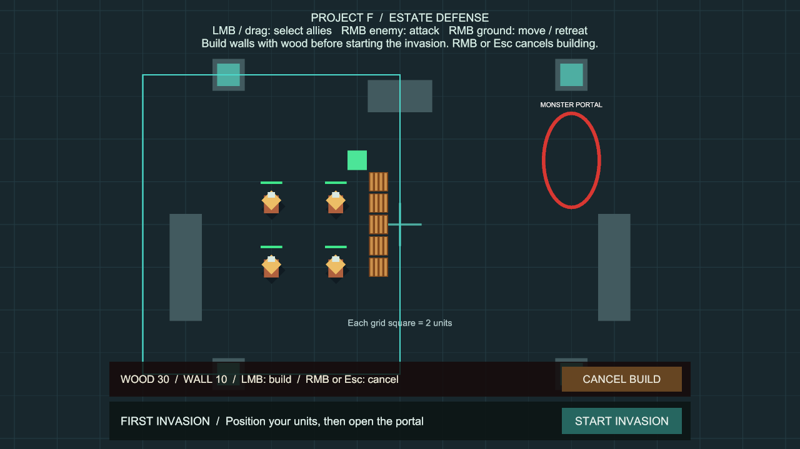
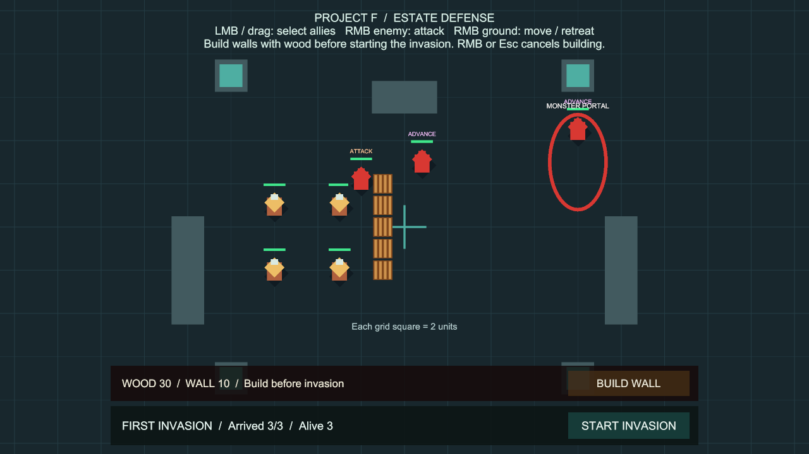

# 목재를 소비하는 방어벽 건설

상태: 사용자 승인 완료, `main` 병합 완료 (`2d05ba2`). 후속 [철거·환급 기능](WallDemolition.md)은 별도 기능 브랜치에서 진행합니다.

## 플레이 방법

추가 준비 없이 **Project F → Open Gameplay → Play**로 실행합니다.

1. 처음에는 목재 **80**이 주어집니다. 벽 한 칸의 비용은 **10**입니다.
2. 화면 아래 **BUILD WALL**을 누릅니다. 청록색 테두리가 건설 가능한 영지 범위입니다.
3. 마우스를 움직여 위치를 고릅니다. 초록 미리보기는 건설 가능, 빨강은 불가능입니다.
4. **좌클릭 한 번에 벽 한 칸**을 즉시 건설합니다. 격자에 맞춰 배치되며, 성공한 경우에만 목재를 차감합니다. 계속 누른 채 움직여도 여러 칸이 지어지지 않습니다.
5. **우클릭 / Esc / CANCEL BUILD**로 건설 모드를 나옵니다. 취소용 우클릭은 아군 이동 명령으로 전달되지 않습니다.
6. 아군을 배치하고 **START INVASION**을 누릅니다. 침공이 시작되면 건설은 잠깁니다. 몬스터는 벽을 우회하거나 후속 [벽 전투 규칙](WallCombat.md)에 따라 공격합니다.
7. 전투 결과의 **RESTART** 또는 Stop → Play로 다시 시작하면 벽이 사라지고 목재 80이 복구됩니다.

예시: 중앙보다 조금 왼쪽인 `x=-1`에 `y=-2,-1,0,1,2`의 다섯 칸을 지으면 목재 30이 남습니다. 아군은 위·아래 끝을 돌아 이동하고, 몬스터는 우회하거나 벽을 공격합니다.

## 배치 규칙

- 침공 준비 버튼을 누르기 **전**에만 건설합니다. 준비 카운트다운·교전·결과 상태에서는 건설할 수 없습니다.
- 일시정지 중에는 건설하지 않습니다. 건설 중 게임 시간이 멈추면 건설 모드를 종료합니다.
- 벽 전체가 영지 경계 안에 들어가야 합니다. 경계선 위에 중심을 놓는 것만으로는 충분하지 않습니다.
- 유닛, 다른 벽, 지형의 고체 충돌체 위에는 건설할 수 없습니다. 미리보기 자체는 충돌체가 없어 검사를 방해하지 않습니다.
- 클릭 순간 다시 검사하므로 초록 표시를 본 뒤 유닛이 그 위치로 들어와도 겹쳐 건설되지 않습니다.
- UI 위, 게임 화면 밖, 카메라를 이동하는 동안에는 미리보기를 숨깁니다.
- 목재가 부족하거나 배치가 막히면 비용을 차감하지 않습니다.
- 취소해도 이미 지은 벽은 남고, 선택했던 아군은 그대로 선택되어 있습니다.

## 설정

Play를 멈추고 **Project F → Select Construction Settings**를 선택합니다.

| 설정 | 기본값 | 의미 |
| --- | --- | --- |
| Wall Wood Cost | 10 | 벽 한 칸의 목재 비용. 최소 1 |
| Grid Size | 1 | 건설 중심점 격자 간격. 최소 1 |
| Territory | x=-12~0, y=-7~7 | 이번 영지의 건설 가능 사각 영역 |

설정 에셋: `Assets/ProjectF/Data/ConstructionSettings.asset`.
초기 목재는 씬의 **Estate Construction → Estate Stockpile → Starting Wood**에서 조절합니다.
수정 후 Stop → Play로 다시 시작합니다. 영지 범위는 현재 이동 가능 지도 안에 유지해야 합니다.

벽 프리팹은 `Assets/ProjectF/Prefabs/PalisadeWall.prefab`입니다. 비활성 루트, 가운데 정렬된 고체 BoxCollider2D, 양수 크기를 유지합니다. 기본 충돌 크기는 0.9×0.9입니다.
외형과 충돌 크기를 조절할 때에는 격자 간격과 통로 폭도 함께 확인해야 합니다.

## 코드 구조

- `EstateStockpile`: 씬별 목재 잔량과 지출. 재시작 시 초기 목재를 읽으며, 플레이 중 시작 수치나 에셋을 수정하지 않습니다.
- `WallConstruction`: 영지·겹침·비용·침공 단계 검사와 실제 벽 생성. 입력이나 UI를 직접 읽지 않습니다.
- `WallPlacementController`: 기존 입력 액션을 읽고 건설 모드, 미리보기, 취소를 처리합니다.
- `ConstructionHUD`: 잔량·배치 결과·버튼 상태를 이벤트로 갱신합니다.
- `WallStructure`: 활성·비활성 시 기존 `NavigationWorld2D`에 지형 변경을 알립니다. 이동·전투용 별도 길찾기를 만들지 않습니다.
- `UnitCommandController.SetPointerCommandsBlocked`: 건설 도구가 월드 클릭을 점유합니다. 소유자별로 차단하므로 한 도구가 종료되어도 다른 도구의 차단을 해제하지 않습니다. 취소 직후 버튼이 떼어질 때까지 월드 입력을 넘기지 않습니다.
- `CommandInput`에 Esc 취소 액션과 우클릭 유지 상태를 추가했습니다. 기존 선택·공격·카메라 입력은 유지합니다.

## 성능과 현재 범위

- 미리보기의 물리 검사는 위치가 바뀌거나 0.1초가 지났을 때 수행하고, 실제 건설 클릭에는 즉시 재검사합니다.
- 고정 충돌 조회 배열과 MaterialPropertyBlock을 재사용합니다. 미리보기 갱신마다 재질이나 GameObject를 생성하지 않습니다.
- 미리보기·카메라가 공유하는 UI 포인터 검사도 PointerEventData를 재사용하며, EventSystem이 바뀔 때에만 다시 생성합니다.
- 목재와 안내 문구는 상태가 달라질 때 갱신합니다. 매 프레임 전역 오브젝트 검색을 하지 않습니다.
- 기본 목재로 최대 8칸을 지을 수 있습니다. 대규모 성벽·수백 명 전투 성능을 보장하는 단계는 아닙니다.
- 벽은 **길을 막는 건설물**입니다. 철거·환급은 후속 [WallDemolition](WallDemolition.md), 체력·몬스터의 벽 공격은 [WallCombat](WallCombat.md)에 추가했습니다. 공성 장비·일꾼·공사 시간, 목재 채집·생산, 저장·불러오기는 아직 포함하지 않습니다. 우회나 공격할 수 없는 통로에서는 유닛이 대기할 수 있습니다.
- 개발용 외형과 영어 HUD를 사용합니다. 패키지나 그래픽·물리 설정 변경은 필요하지 않습니다.

## 검증

검증일: 2026-10-02 (Asia/Seoul).

- Unity 6000.6.0f1에서 전체 PlayMode 검사 **80개 통과, 실패·건너뜀 0개**, 149.17초. 최종 입력 데이터 재사용 변경까지 포함합니다. 원본 결과: `Logs/construction-tests-final.json`.
- 건설 전용 검사 **12개 통과**, 5.97초. 비용·중복·경계·유닛 겹침·자원 소진·실제 버튼과 포인터 입력·취소·입력 차단 소유권·클릭 재검사·UI 관통 방지·일시정지·침공 잠금·벽 우회·재시작을 검증합니다.
- Editor Play에서 벽 5칸 생성과 목재 80→30, 초록 미리보기와 영지 경계, 침공 시 건설 종료, 벽 위쪽 끝을 우회한 적의 교전을 확인했습니다. 화면 확인용 배치는 런타임 건설 API로, 미리보기는 Input System 포인터 이벤트로 수행했습니다. 클릭 동작은 자동 검사에서 확인했습니다.
- Play 종료 후 BasicCombat 씬은 저장 상태이며 누락 스크립트 0개, 영구 저장된 임시 벽 0개입니다. 이번 검사에서 새 Console 오류는 없었습니다.
- Windows x64 빌드 성공: 14.799초, 132,799,806바이트, 오류 0개. 기존과 같은 경고 501개는 AI inference 셰이더 500개와 Player에서 개발 도구 Pipeline을 비활성화한다는 안내 1개입니다. 원본 결과: `Logs/construction-build-final.json`.
- 실행 파일: `Builds/WallBuilding/ProjectF_WallBuilding.exe`. 화면 없는 시작 검사에서 엔진·Input System 초기화와 프로세스 유지, 예외 없음 확인 후 검사용 프로세스를 종료했습니다. 이 검사는 독립 실행 파일의 실제 화면·마우스 조작 검증을 대신하지 않습니다.
- `Assets/ProjectF`의 메타 파일 누락·중복 GUID 0개. 패키지·프로젝트 설정은 변경하지 않았습니다.

