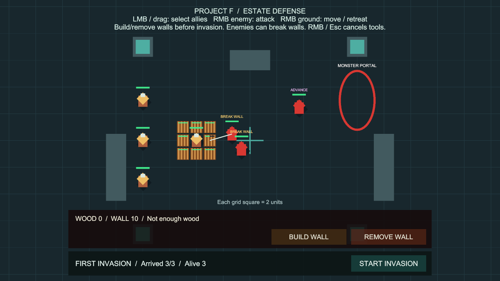
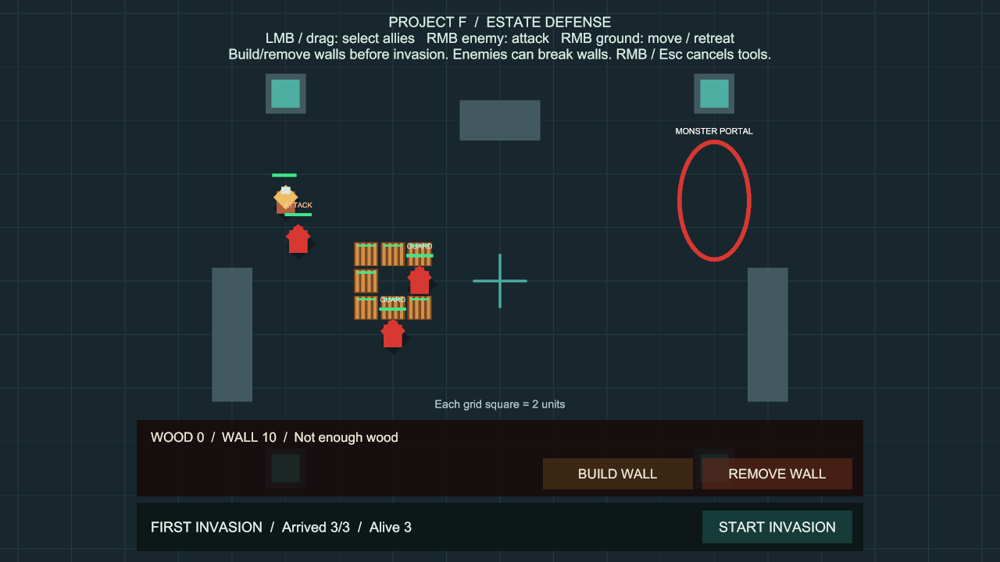

# 방어벽 체력과 몬스터의 벽 공격

상태: 사용자 승인 완료. 구현 커밋 `62266f2`, main 병합 `ef99c05`.

## 플레이 방법

추가 준비 없이 **Project F → Open Gameplay → Play**로 실행합니다.

1. **BUILD WALL**로 벽을 배치합니다. 각 벽에 초록색 체력바가 표시됩니다.
2. 아군을 벽 뒤에 배치하고 **START INVASION**을 누릅니다.
3. 몬스터가 진격 방향을 막는 가까운 벽을 발견하면 **BREAK WALL** 상태로 접근·공격합니다.
4. 벽 체력이 줄고, 0이 되면 벽이 사라집니다. 몬스터는 원래 진격을 재개합니다.
5. 벽으로 확보한 시간 동안 아군을 선택해 적을 우클릭하여 방어합니다.

초기 벽 체력은 **60**, 기본 몬스터 공격은 **10 / 1초**입니다. 단독 몬스터의 타격 6회로 파괴됩니다. 여러 몬스터가 같은 벽을 공격하면 더 빨리 무너집니다.

## 벽 선택과 전투 규칙

- 기존 적 AI에 `Breaching` 상태를 추가했습니다. 침공처럼 **진격 명령을 받은 적**만 자동으로 벽을 찾습니다. 경계 중인 적은 가까운 벽을 무조건 공격하지 않습니다.
- **보이는 아군 유닛을 우선** 공격합니다. 벽 공격 중에도 보이는 아군이 생기면 유닛 교전으로 전환합니다.
- 진격 목적지 방향으로 최대 **4 유닛 거리**를 검사해, 처음 가로막는 고체 충돌체가 살아 있는 방어벽이면 대상으로 삼습니다. 길 옆의 벽이나 부술 수 없는 지형 뒤에 가려진 벽을 임의로 고르지 않습니다.
- 기존 길찾기로 벽의 가까운 면에 접근하고, 실제 공격 거리와 시야를 만족해야 타격합니다. 다른 벽이나 지형을 뚫고 피해를 주지 않습니다.
- 유닛 공격과 벽 공격은 같은 공격 주기를 공유합니다. 목표를 반복 지정하거나 유닛↔벽으로 바꿔도 공격 속도가 빨라지지 않습니다.
- 벽이 없어지거나 비활성화되면 목표를 해제하고 진격을 재개합니다. AI 비활성·적 사망·침공 종료 시 벽 공격도 멈춥니다.
- 접근·공격 진행이 없으면 기존 `Stalled Pursuit Timeout` 후 포기하고, `Wall Retry Delay` 동안 같은 벽을 다시 선택하지 않습니다. 추적 거리도 기존 `Leash Radius`로 제한합니다.
- 벽의 **전투 파괴는 목재를 환급하지 않습니다**. 준비 중 직접 철거한 경우에만 기존 환급 규칙을 적용합니다.
- 파괴 순간 충돌을 제거하고 기존 길찾기에 지형 변경을 알립니다. 같은 프레임에 여러 번 맞아도 파괴 이벤트는 한 번만 발생합니다.
- 아군은 자기 벽을 공격할 수 없습니다. 수리·재건은 별도 기능이며, 현재는 침공 중 건설·철거가 잠깁니다.

## 설정

Play를 멈춘 뒤 변경합니다.

| 메뉴 / 설정 | 기본값 | 역할 |
| --- | --- | --- |
| Select Construction Settings → Wall Max Health | 60 | 새로 건설할 벽의 최대 체력 |
| Select Enemy AI Settings → Wall Detection Distance | 4 | 진격 방향의 벽 감지 거리 |
| Select Enemy AI Settings → Wall Retry Delay | 4초 | 접근 실패한 같은 벽의 재선택 대기 |
| Select Enemy AI Settings → Stalled Pursuit Timeout | 4초 | 이동·타격 진전이 없는 추적을 포기하는 시간 |
| Select Enemy Combat Settings → Attack Damage / Attack Interval / Attack Reach | 10 / 1초 / 0.85 | 기존 유닛·벽 공통 공격 설정 |

벽 체력은 건설 시 확정합니다. 설정을 바꿔도 이미 지은 벽의 체력은 변하지 않습니다. Stop → Play 또는 RESTART 시 기존 벽은 초기화됩니다.

## 코드 구조와 성능

- `WallStructure`: 체력·피격·파괴를 소유합니다. 소유권·환급 데이터는 기존 철거 기능과 함께 유지합니다.
- `UnitCombat`: 기존 근접 전투에 별도 형식의 벽 대상을 추가했습니다. 기존 `Target`, `Attack(UnitCombat)` API는 유지하고 `WallTarget`, `AttackWall`을 제공합니다. 동시에 한 대상만 공격합니다.
- `EnemyCombatAI`: 벽을 고르고 진격·벽 공격·유닛 교전을 전환합니다. 직접 피해나 이동 속도를 처리하지 않습니다.
- `WallHealthView`: 체력 변경 이벤트로 메시 체력바를 갱신합니다. 벽마다 Canvas나 매 프레임 UI 갱신을 추가하지 않습니다.
- `CombatFeedback`, `EnemyAIStatusView`: 기존 타격선과 상태 표시를 벽 공격에도 사용합니다.
- 벽 탐지는 기존 AI 판단 간격에만 실행하고, 고정 크기 배열을 재사용합니다. 공격 중 시야 검사는 재사용 배열로 제한하며 무기 대기 중에는 조회하지 않습니다.
- 길찾기·충돌·단색 재질·건설 프리팹을 재사용합니다. 새 패키지나 프로젝트 설정 변경은 없습니다.

## 현재 범위

이번 단계는 기본 근접 벽 공격입니다. 공성 병종·공성 장비, 공격 비용과 우회 거리 비교, 여러 경로의 최적 돌파 지점 탐색, 수리·일꾼·잔해·공성 애니메이션·저장은 포함하지 않습니다. 몬스터가 우회 가능한 벽을 공격할 수도 있으며, 경로 전체의 벽을 검색하는 시스템은 아닙니다.

## 검증

검증일: 2026-10-02 (Asia/Seoul).

- Unity 6000.6.0f1에서 전체 PlayMode 검사 **108개 통과, 실패·건너뜀 0개**, 180.66초. 기존 93개와 새 벽 전투 15개를 포함합니다. 원본: `Logs/wall-combat-tests-final.json`.
- 벽 전투 전용 검사 **15개 통과**, 27.37초. 체력·표시·피해 규칙·중복 파괴·환급 차단·공통 공격 주기·사거리·시야·취소·정지·사망·AI 우선순위·접근 실패·복수 공격·재시작을 확인했습니다.
- 실제 침공 자동 검사에서는 방어벽 8칸으로 둘러싼 아군 쪽을 돌파한 뒤 유닛 공격으로 전환하고, 패배 결과 후 남은 벽 공격이 멈추는 것을 확인했습니다.
- 첫 검사 요청은 Unity의 씬 저장 대화상자 때문에 실행되지 않았습니다. 저장 전후 파일 내용이 동일한 것을 확인하고 검사를 다시 실행했으며, 중단된 요청은 통과 수에 포함하지 않았습니다.
- 기본 설정의 Editor Play에서 아군 1명을 벽 8칸으로 둘러싸고 실제 포탈 침공을 시작했습니다. 벽 60→30 체력·타격선·BREAK WALL 표시, 벽 8→7칸 파괴, 목재 0 유지, 몬스터의 통과·아군 교전을 화면으로 확인했습니다. 시험 배치와 시작은 런타임 API로 수행했고, 체력·피해량을 변경하지 않았습니다. 촬영을 위한 일시정지는 에디터에서만 사용했습니다.
- Play 종료 후 저장된 BasicCombat 씬에 임시 배치를 남기지 않았습니다. 씬 누락 스크립트 0개, 벽 프리팹 비활성 상태·체력바 참조 연결 정상, 메타 파일 누락·중복 GUID 0개입니다.
- 최종 검사·플레이 중 게임 코드의 새 Console 오류 0개. 저장 대화상자로 막혔을 때 발생한 에디터 명령 시간 초과 1건은 별도 기록했습니다.
- Windows x64 빌드 성공: 14.836초, 132,810,658바이트, 오류 0개. 기존과 같은 경고 501개는 AI inference 셰이더 500개와 개발 도구 Pipeline의 Player 비활성 안내 1개입니다. 원본: `Logs/wall-combat-build-final.json`.
- 실행 파일 `Builds/WallCombat/ProjectF_WallCombat.exe`의 화면 없는 시작 검사에서 엔진·Input System 초기화, 프로세스 유지, 예외 없음 확인 후 검사용 프로세스를 종료했습니다. Unity 통계 서버 `cdp.cloud.unity3d.com`에 대한 DNS 오류가 3건 기록됐으며, 게임 프로세스는 계속 실행됐습니다. 독립 실행 파일의 실제 화면·마우스 조작은 별도로 검증하지 않았습니다.

