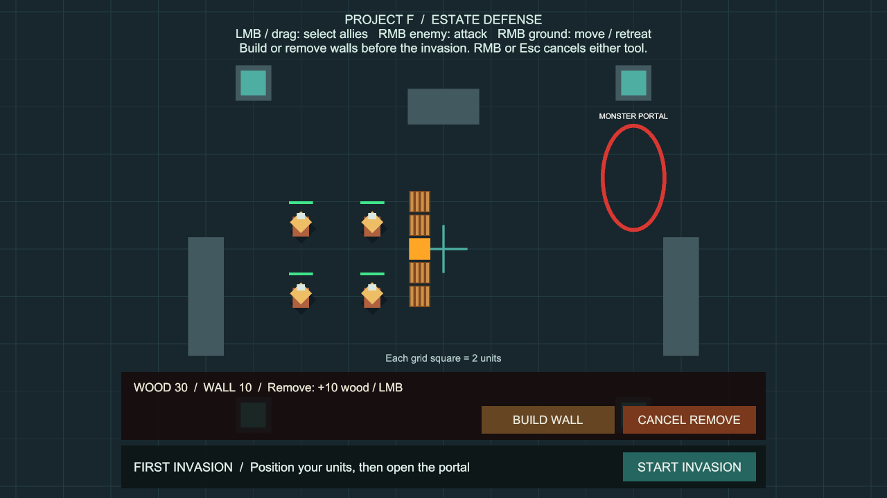
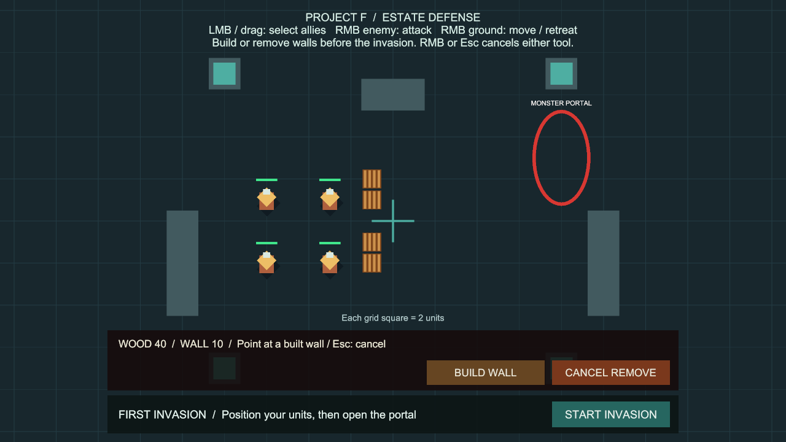

# 방어벽 철거와 목재 환급

상태: 구현·검증 완료, 사용자 최종 확인 대기. 확인 후 main에 병합합니다.

## 플레이 방법

추가 준비 없이 **Project F → Open Gameplay → Play**로 실행합니다.

1. **BUILD WALL**을 눌러 방어벽을 건설합니다.
2. **REMOVE WALL**을 누르면 철거 모드로 전환합니다. 건설 모드 중에도 바로 전환할 수 있습니다.
3. 직접 지은 벽 위에 마우스를 올리면 **주황색 표시**와 **환급 목재 수량**이 나옵니다.
4. **좌클릭 한 번으로 벽 한 칸**을 철거합니다. 기본 설정에서는 목재 10을 돌려받습니다.
5. **우클릭 / Esc / CANCEL REMOVE**로 철거 모드를 종료합니다. 우클릭 취소가 아군 이동 명령으로 전달되지 않습니다.
6. **BUILD WALL**로 돌아가 방어선을 다시 배치한 뒤 **START INVASION**을 누릅니다.

예시: 벽 5칸을 지으면 목재가 80→30, 가운데 한 칸을 철거하면 40이 됩니다. 해당 칸의 충돌이 즉시 없어지고 아군·적 모두 그 통로를 이용할 수 있습니다.

## 규칙

- 침공 시작 전 준비 단계에서만 철거할 수 있습니다. 침공 카운트다운·교전·결과 상태에서는 건설과 철거를 모두 잠급니다.
- 기본 환급은 건설에 쓴 목재의 **100%**입니다. 준비 중 배치 실수를 고치기 위한 기본 규칙이며, 경제 균형에 따라 설정을 바꿀 수 있습니다.
- **건설 당시 확정한 환급액**을 벽마다 보관합니다. 이후 비용이나 환급률을 바꿔도 이미 지은 벽의 환급액은 바뀌지 않습니다.
- 목재가 0이어도 철거할 수 있습니다. 환급받으면 다시 건설할 수 있습니다.
- 직접 건설한 활성 벽만 대상입니다. 지도 지형·유닛·소유하지 않은 벽·빈 공간을 클릭해도 자원이 변하지 않습니다.
- 벽 사이의 빈 틈을 클릭하면 인접 벽을 임의로 철거하지 않습니다.
- 마우스를 누른 채 다른 벽으로 이동해도 연속 철거하지 않습니다. 한 칸마다 새 클릭이 필요합니다.
- UI 위·게임 화면 밖·카메라 이동 중에는 철거를 막고 대상 표시를 숨깁니다.
- 일시정지 시 도구를 종료하고, 재개하면 버튼이 다시 활성화됩니다.
- 재시작하면 벽과 도구 상태를 초기화하고 시작 목재 80으로 돌아갑니다.

## 설정

Play를 멈추고 **Project F → Select Construction Settings**를 엽니다.

| 항목 | 기본값 | 의미 |
| --- | --- | --- |
| Wall Wood Cost | 10 | 건설 비용 |
| Demolition Refund Percent | 100 | 철거 환급률, 0~100% |

환급액은 `건설 비용 × 환급률 ÷ 100`의 소수점 이하를 버립니다. 비용 17, 환급률 50이면 목재 8을 돌려받습니다. 0%에서도 철거는 가능합니다.

## 구현과 유지보수

- `WallConstruction`: 기존 건설 규칙과 같은 소유자가 철거 가능 여부·벽 소유권·환급을 처리합니다. 중복 요청과 환급 이벤트의 재진입을 막습니다.
- `WallStructure`: 건설 당시 소유자·환급액·철거 상태를 보관합니다. 철거 순간 비활성화해 지연 삭제 전에 충돌을 제거하고 기존 길찾기 캐시를 갱신합니다.
- `EstateStockpile`: 목재 추가를 제공하고, 음수·0·정수 범위를 넘는 추가 요청을 거절합니다. 환급을 받을 수 없으면 벽을 보존합니다.
- `WallPlacementController`: 기존 입력을 공유하는 `None / Build / Demolish` 모드입니다. 별도 입력 맵이나 전역 관리자를 추가하지 않습니다.
- `ConstructionHUD`: 환급액·버튼·안내 문구를 이벤트로 갱신합니다. 일시정지 상태는 가벼운 가능 여부 비교로 감지하며, 값이 바뀔 때만 UI를 갱신합니다.
- 철거 대상 조회는 재사용 배열을 사용하고 포인터 이동 또는 0.1초 경과 시 갱신합니다. 클릭할 때는 새로 조회하고 규칙을 재검사합니다. 표시용 메시와 MaterialPropertyBlock도 재사용합니다.
- 기존 건설 패널에 철거 버튼을 추가했습니다. 패키지·프로젝트 설정 변경 없이 기존 uGUI와 영어 개발 HUD를 유지합니다.

## 현재 범위

이번 기능은 침공 전 방어선 수정입니다. 벽 체력·피격·적의 벽 공격·자동 철거, 공사 시간·일꾼, 수리, 채집·생산, 저장·불러오기는 후속 기능입니다. 막힌 길의 벽을 적이 부수는 기능은 아직 없습니다.

## 검증

검증일: 2026-10-02 (Asia/Seoul).

- Unity 6000.6.0f1에서 전체 PlayMode 검사 **93개 통과, 실패·건너뜀 0개**, 155.87초. 기존 80개와 새 철거 13개를 포함하며 일시정지 후 버튼 복구 수정까지 검증했습니다. 원본 결과: `Logs/demolition-tests-final.json`.
- 철거 전용 첫 검사 **13개 통과**, 5.38초. 중복·이벤트 재진입·환급률·정수 범위·소유권·실제 버튼과 마우스 입력·연속 누름·모드 전환·취소·UI 보호·목재 소진·침공 잠금·통로 재개방·재시작을 확인했습니다.
- Editor Play에서 벽 5칸 건설(목재 30) → REMOVE WALL → 주황색 대상과 +10 안내 → 좌클릭 → 벽 4칸·목재 40을 확인했습니다. 화면 확인용 건설은 런타임 API, 철거 진입은 실제 버튼 콜백, 포인터와 좌클릭은 Input System 이벤트를 사용했습니다. 실제 UI 버튼 클릭은 자동 검사에 포함합니다.
- 최종 Play 종료 후 BasicCombat 씬은 저장 상태, 누락 스크립트 0개입니다. 프로젝트 메타 파일 누락·중복 GUID도 0개입니다.
- Windows x64 빌드 성공: 12.617초, 132,804,686바이트, 오류 0개. 기존 경고 501개(AI inference 셰이더 500개, 개발 도구 Pipeline의 Player 비활성 안내 1개)는 동일합니다. 원본 결과: `Logs/demolition-build-final.json`.
- 실행 파일: `Builds/WallDemolition/ProjectF_WallDemolition.exe`. 화면 없는 시작 검사에서 엔진·Input System 초기화, 프로세스 유지, 예외 없음 확인 후 검사용 프로세스를 종료했습니다. 독립 실행 파일의 실제 화면·마우스 조작은 별도로 검증하지 않았습니다.
- 최종 검사와 Play에서 게임 코드의 새 Console 오류 0개. 개발 중 CLI 명령 이름 오류 1건은 올바른 에디터 갱신 호출로 수정했고 기준 로그에 남겼습니다.

