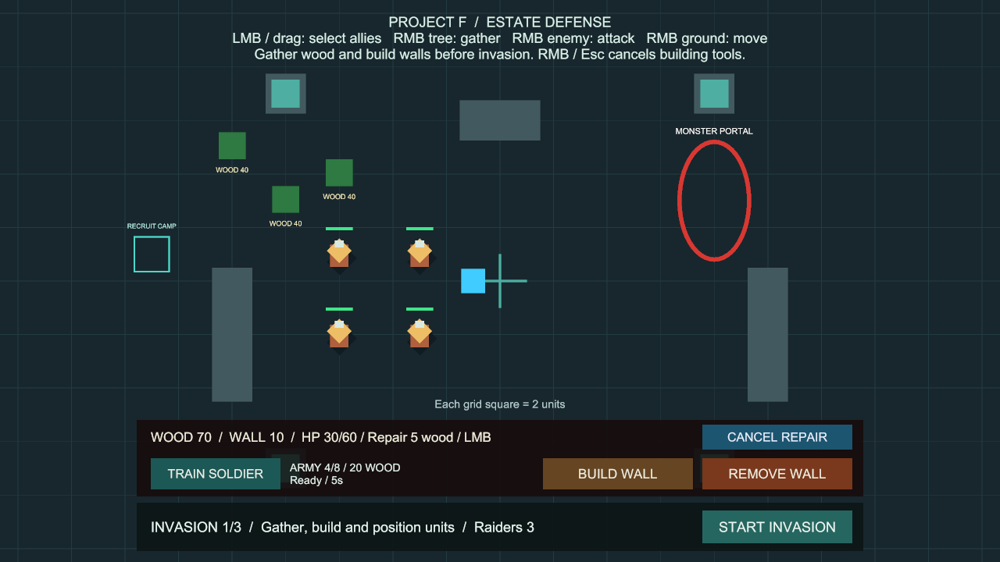
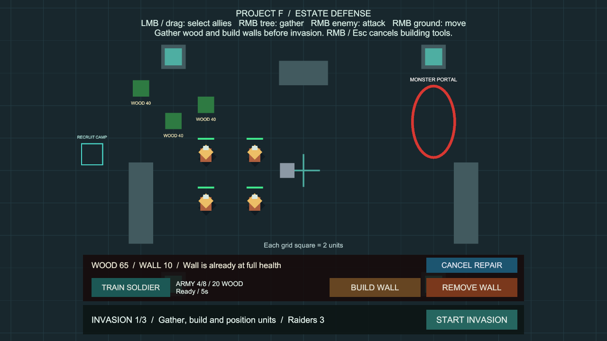

# 준비 단계의 방어벽 수리

상태: 사용자 승인 완료. 구현 `86ab609`, main 병합 `b8ad011`, GitHub 반영 완료.

## 플레이 방법

**Project F → Open Gameplay → Play**로 실행합니다. 별도 준비는 없습니다.

1. 방어벽을 짓고 침공을 막습니다.
2. 격퇴 후 **NEXT ROUND**를 눌러 다음 준비에 들어갑니다.
3. **REPAIR WALL**을 누르고 손상된 벽을 가리킵니다. 현재 체력과 필요한 목재가 표시됩니다.
4. 파란색으로 표시된 벽을 좌클릭하면 목재를 소비해 최대 체력으로 즉시 복구합니다.
5. 우클릭·Esc·**CANCEL REPAIR**로 종료합니다. 다른 건설 도구를 누르면 해당 모드로 전환합니다.

- 파란색: 수리 가능. 회색: 이미 온전한 벽. 빨간색: 목재 부족 등 수리 불가.
- 준비 단계에서 자신이 지은 살아 있는 벽만 수리합니다. 전투·결과 화면·일시정지에서는 잠깁니다.
- 같은 벽을 다시 눌러도 온전하면 추가 비용이 없습니다. 파괴된 벽은 재건설해야 합니다.
- 수리는 위치·충돌체·길찾기 장애물을 교체하지 않고 기존 벽의 체력만 복구합니다.

## 비용과 철거 환급

수리는 **건설 당시 실제 비용 × 손상 체력 비율을 올림**합니다. 온전한 벽은 수리할 필요가 없으며 비용 0입니다.

손상된 벽을 철거하면 **건설 당시 확정한 최대 환급액 × 남은 체력 비율을 내림**해 돌려받습니다. 온전한 벽의 환급액은 이전과 같습니다. 전투로 파괴된 벽에는 환급이 없습니다.

기본 건설비 10, 최대 체력 60, 철거 환급률 100%일 때:

| 남은 체력 | 완전 수리 비용 | 지금 철거할 때 환급 |
| --- | --- | --- |
| 60/60 | 0 (수리 불필요) | 10 |
| 59/60 | 1 | 9 |
| 45/60 | 3 | 7 |
| 30/60 | 5 | 5 |
| 1/60 | 10 | 0 |

예를 들어 체력 30/60 벽의 수리는 5입니다. 철거해서 5를 돌려받고 10으로 새 벽을 지어도 순소비는 5이므로 무료 복구가 되지 않습니다. 수리 후 철거하면 최대 환급액을 받지만 앞서 수리 비용을 냈으므로 손상된 벽으로 이득을 만들 수 없습니다.

**Project F → Select Construction Settings**에서 새 벽의 비용·최대 체력·환급률을 바꿀 수 있습니다. 기존 벽은 구매 당시 비용·최대 체력·최대 환급액을 유지합니다. 이번 단계에서는 작업자 배정·수리 시간·부분 수리·전투 중 수리·유닛 치유·저장을 추가하지 않았습니다.

## 코드와 유지보수

- `WallStructure`가 현재 체력·구매 비용·최대 환급액과 정수 비용 계산을 소유합니다. 곱셈에 `long`을 사용해 큰 비용에서도 오버플로를 피합니다.
- `WallConstruction.ValidateRepair/TryRepair`가 준비 상태·벽 소유권·생존 여부·손상·자원을 검사합니다. 기존 건설·철거와 같은 작업 잠금을 사용해 이벤트 안의 중복 수리·건설·철거를 거부합니다.
- `EstateStockpile`의 내부 결제 진입점은 목재를 차감한 뒤 수리를 완료하고 자원 변경 알림을 보냅니다. 체력·자원 관찰자는 모두 이미 반영된 값을 보므로 수리 알림 도중 파괴된 벽을 다시 살리지 않습니다. 기존 공개 결제 API는 유지합니다.
- `WallPlacementController`에 Repair 모드를 추가했습니다. 기존 포인터 점유·UI 클릭 보호·미리보기 재료·0.1초 대상 점검을 재사용합니다. 체력·비용이 변하면 마우스가 멈춰 있어도 안내를 갱신합니다.
- `ConstructionHUD`와 `WallRepairSetup`이 수리 버튼과 안내를 연결합니다. 기존 병력 충원·건설·철거 버튼을 유지하고 상태 줄 오른쪽에 수리 버튼을 배치했습니다.
- 추가 전역 관리자·매 프레임 씬 검색·씬 재로딩은 없습니다. 건강한 벽의 중복 클릭은 자원·체력 변경 이벤트를 발생시키지 않습니다.
- 기존 차수 보존 검사의 철거 기대값을 10→7로 갱신했습니다. 체력 45/60 벽에 새 환급 규칙을 적용한 변경이며, 이전 이동·전투 검사는 그대로 유지했습니다.

## 검증

Unity 6000.6.0f1 / Windows x64 / 2026-10-07 (Asia/Seoul).

- 수리 전용 PlayMode 검사 **14개 통과**, 실패·건너뜀 0개, **4.78초**.
- 수리 비용·환급 반올림 방향·구매 조건 유지·정수 상한, 자원 부족, 소유하지 않은 벽·파괴된 벽, 중복 요청, 알림 중 파괴, 실제 버튼·벽 클릭, 도구 전환·취소, UI 클릭 보호·빈틈 선택, 전투 잠금과 다음 준비의 수리를 검사했습니다.
- 기본 설정 Play에서 검증용 환경 피해로 체력 30/60 벽을 만들었습니다. 가상 마우스로 벽을 좌클릭해 체력 60, 목재 70→65, 철거 가능 환급액 5→10을 확인했습니다. 임시 입력 장치를 제거하고 Play를 종료했습니다.
- 1280×720 화면에서 수리 전후 안내·버튼·다른 건설 UI가 겹치지 않는 것을 확인했습니다.
- 전체 PlayMode 검사 **159개 통과**(기존 145개 + 수리 14개), 실패·건너뜀·판정 불가 0개, **211.62초**.
- Windows x64 빌드 성공, **오류 0개**, **12.343초**, **132,850,658바이트**. 기존 빌드와 같은 경고 501건이며 새 경고 유형은 없습니다. AI inference 셰이더와 Player에서 Pipeline을 비활성화한다는 기존 안내입니다.
- `Builds/WallRepair/ProjectF_WallRepair.exe`를 화면 없이 실행해 엔진·입력 초기화와 프로세스 유지를 확인했습니다. 시작 로그의 오류·예외는 0개입니다. 게임 화면과 클릭 동작은 위 Editor Play 검증으로 확인했습니다.
- 최종 `BasicCombat` 씬은 Play를 멈춘 저장 상태입니다. 누락 스크립트 0개, 수리 버튼·라벨 연결 정상, EventSystem 1개. 추가 패키지나 프로젝트 설정 변경은 없습니다.
- 원본 검증 기록: `Logs/wall-repair-tests-first.json`, `Logs/wall-repair-tests-final.json`, `Logs/wall-repair-build-final.json`, `Logs/WallRepair-player.log`. Logs와 Builds는 로컬 검사 산출물이며 Git에는 코드·검사·씬·문서·화면을 보관합니다.

