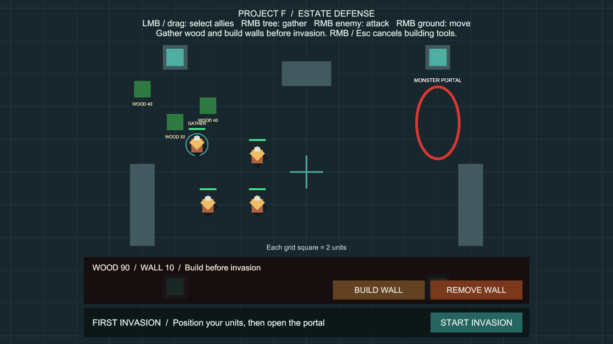
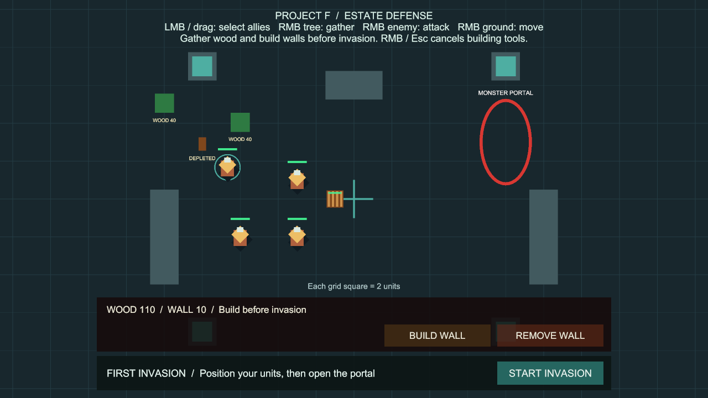

# 목재 채집

상태: 구현·검증 완료, 사용자 최종 확인 대기. 확인 후 main에 병합합니다.

## 플레이 방법

별도 준비 없이 **Project F → Open Gameplay → Play**로 실행합니다.

1. 아군을 좌클릭하거나 드래그로 여러 명 선택합니다.
2. 영지 왼쪽 위 초록색 나무(`WOOD 40`)를 **우클릭**합니다.
3. `TO WOOD` 상태로 접근한 뒤 `GATHER` 상태에서 **2초마다 목재 5**를 얻습니다. 하단의 기존 WOOD 잔량에 즉시 반영됩니다.
4. 얻은 목재는 **BUILD WALL**로 사용합니다. 벽 한 칸은 기존처럼 목재 10입니다.
5. 땅을 우클릭하면 채집을 취소하고 이동합니다. 적 공격 명령이나 **START INVASION**도 채집을 중단합니다.

기본 나무는 3곳, 각각 목재 40이므로 총 120을 추가로 얻을 수 있습니다. 소진된 나무는 `DEPLETED` 표시와 그루터기만 남고, 충돌이 제거되어 통과·건설이 가능합니다. Stop → Play 또는 RESTART 시 목재·나무·채집 명령이 초기화됩니다.

## 규칙과 범위

- 기존 아군 4명에게 채집 명령을 연결한 첫 경제 단계입니다. 전용 일꾼, 노동력 배정, 벌목장, 운반·저장고, 재생·저장은 후속 기능입니다.
- 채집은 침공 시작 전 준비 상태에서만 가능합니다. 침공 시작 시 기존 작업을 취소하며, 전투 중이나 결과 화면에서는 새 채집을 받지 않습니다.
- 목재는 나무 가까이 도착하고, 그 사이에 벽·지형이 없을 때만 얻습니다. 이동 도중이나 장애물 너머에서는 채집하지 않습니다.
- 여러 유닛이 같은 나무를 채집할 수 있습니다. 마지막 남은 수량만 지급하므로 중복 지급·음수 잔량이 발생하지 않습니다. 자원 지점 간 자동 이동은 없습니다.
- 같은 나무를 반복 클릭해도 진행 시간을 초기화하거나 지급을 앞당기지 않습니다. 새 대상으로 바꾸면 해당 대상의 작업 시간을 새로 채웁니다.
- 일시정지는 작업 시간을 멈춥니다. 유닛 사망·비활성화, 대상 소멸, 자원 시스템 비활성화 시 작업을 중단합니다.
- 접근이 진행되지 않으면 `NO PATH`를 표시하고 명령을 종료합니다. 경로를 확보한 뒤 다시 우클릭할 수 있습니다.
- 목재 정수 저장 범위를 초과하는 지급은 나무를 소모하지 않고 `WOOD FULL` 상태로 기다립니다. 목재를 소비하면 작업을 다시 시작합니다.
- 기존 건설·철거 도구와 UI 클릭 보호를 그대로 적용합니다. 건설 도구 사용 중 나무 우클릭은 도구 취소이며 채집 명령으로 새지 않습니다.

## 설정과 유지보수

Play를 멈춘 뒤 **Project F → Select Wood Gathering Settings**에서 조절합니다.

| 설정 | 기본값 | 용도 |
| --- | --- | --- |
| Wood Per Cycle | 5 | 작업 완료당 목재 |
| Cycle Seconds | 2초 | 가까이서 작업해야 하는 시간 |
| Gathering Reach | 0.8 | 유닛 반경 외 추가 작업 거리 |
| Approach Retry Seconds | 0.5초 | 이동 목적지 재요청 간격 |
| Stalled Seconds | 6초 | 이동 진전이 없을 때 포기 시간 |

나무별 최초 목재는 씬의 **Wood Resources → Wood Grove → Wood Resource Node → Starting Wood**에서 조절합니다. 설정은 정지 상태에서 변경하고 다시 Play합니다.

- `WoodResourceNode`: 나무 잔량과 재고로의 자원 이전을 소유합니다. 지급 전에 잔량을 예약해 재고 변경 이벤트 중 재진입에도 과다 지급을 막습니다.
- `WoodGatherer`: 명령, 접근, 작업 시간과 취소를 관리합니다. 기존 `NavigationWorld2D` 이동을 사용하며 별도 길찾기나 물리 이동을 추가하지 않습니다.
- `UnitCommandController`: 적 우클릭 → 자원 우클릭 → 땅 이동 순서로 명령을 구분합니다. 자원 조회는 클릭할 때만 실행합니다.
- `UnitCombat.AttackCommandIssued`: 성공 가능한 공격 명령을 받을 때 채집에 취소를 알립니다. 기존 전투 대상·공격 주기는 유지합니다.
- `WoodResourceView`, `WoodGathererView`: 잔량과 상태가 바뀔 때만 텍스트·외형을 갱신합니다. 기존 프로젝트의 TextMesh 표시 방식을 따릅니다.
- 물리 조회 버퍼를 재사용하며, 런타임 전체 오브젝트 검색이나 매 프레임 UI 문자열 생성은 없습니다. 나무 소진 시 기존 길찾기의 지형 캐시를 무효화합니다.
- 에디터 구성 메뉴는 **Project F → Setup → Add Wood Gathering**입니다. 이미 구성된 씬에서는 중복 생성하지 않습니다. 실제 사용 씬은 구성 완료 상태로 커밋합니다.

## 검증

검증일: 2026-10-05~06 (Asia/Seoul).

- 최초 검사에서 나무 한 곳과 기존 지형의 겹침을 발견해 배치를 수정했습니다. 기본 카메라에서 하단 HUD에 가려지지 않도록 최종 나무 배치를 왼쪽 위로 옮겼습니다.
- 표시 수정 전 전체 검사 122개 통과(199.81초). 실제 화면 검사에서 컴포넌트 초기화 순서에 따른 첫 나무 표시 문제를 발견해 수정하고 초기 외형 검사 1개를 추가했습니다. 최종 결과는 아래에 기록합니다.
- 최종 전체 PlayMode 검사 **123개 통과**, 실패·건너뜀·미결정 0개, **199.91초**. 기존 108개와 목재 채집 15개를 포함합니다. 원본: `Logs/wood-gathering-tests-final.json`.
- 채집 전용 검사는 초기 외형, 마우스 선택·우클릭·접근·추가 건설, 유한 잔량·마지막 부분 지급·충돌 제거, 반복 명령, 이동·공격 전환, 침공 취소, 일시정지·비활성·사망, 대상 소멸, 저장 범위 초과, 벽 너머 작업 차단, 복수 채집, UI·건설 도구 클릭 보호, 접근 실패·재시도, 씬 재시작을 확인합니다.
- 기본 설정의 실제 Play에서 한 아군이 접근·채집하면서 재고 80→90, 나무 40→30, GATHER 표시를 확인했습니다. 이어 한 나무를 소진해 재고 120, 남은 나무 0·충돌 제거, 방어벽 1칸 건설 후 목재 110을 확인했습니다. 이동 위치·생산량·작업 시간은 기본값을 사용했고 명령은 런타임 API로 실행했습니다. 마우스 입력은 자동 검사에서 별도로 검증합니다.
- 침공 시작 시 채집 대상이 즉시 해제되고 Idle 상태로 돌아오는 것을 확인했습니다. 촬영 시 일시정지를 사용했으며 Play 변경은 저장하지 않습니다.
- 최종 Play 후 씬 누락 스크립트 0개, 나무 3개·채집 컴포넌트 4개 연결, 메타 파일 누락·중복 GUID 0개. Console 실제 오류·경고 0개를 확인했습니다. 개발 중 씬 저장 대화상자로 인한 도구 명령 시간 초과는 게임 코드 오류와 구분했습니다. 패키지·프로젝트 설정 변경은 없습니다.
- 저장된 씬의 아군 4명 모두 채집 설정·재고·침공 참조 연결 정상. 나무 3곳의 초기 충돌 겹침 0개. Play 종료 후 BasicCombat을 열어 둔 상태이며 미저장 씬 변경은 없습니다.
- Windows x64 빌드 **성공**, 24.410초, 132,827,202바이트, 오류 0개·경고 501개(이전 빌드에도 있던 경고). 원본: `Logs/wood-gathering-build-final.json`. 실행 파일: `Builds/WoodGathering/ProjectF_WoodGathering.exe`.
- 실행 파일의 화면 없는 시작 검사에서 엔진·Input System 초기화와 프로세스 유지를 확인하고 검사용 프로세스를 종료했습니다. 확인한 시작 로그에서 오류·예외는 발견되지 않았습니다. 독립 실행 파일의 실제 화면·마우스 조작은 별도 검증하지 않았으며 Editor Play와 자동 입력 검사로 확인했습니다.

